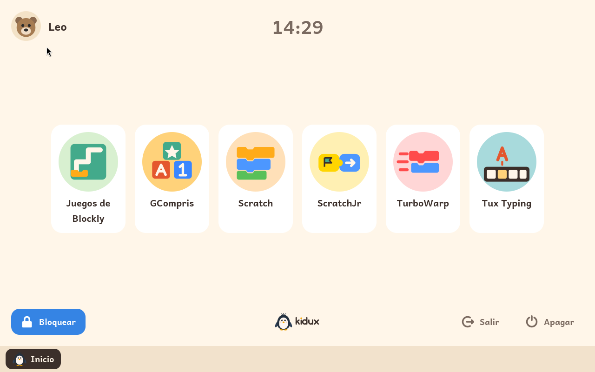

  <a href="https://kidux.org/es/"><b>kidux.org</b></a> ·
  <a href="README.md">English version</a>

**Kidux es un Linux para el primer ordenador de un niño o una niña.** Se
instala en cualquier ordenador de 64 bits, viejo o nuevo, y se le entrega
al niño. El niño tiene entonces una máquina que es suya: su nombre y su
dibujo en la pantalla de inicio, su contraseña, su idioma, y solo lo que un
adulto ha decidido que puede usar, durante el tiempo que el adulto ha
decidido.

Kidux es gratuito para las familias y su código está publicado; está
construido sobre Debian, en español y en inglés.

## Lo que ve un niño

El ordenador arranca en una pantalla de inicio con el dibujo de cada niño.
El niño toca su dibujo, escribe su contraseña, y ya está dentro. No hay
escritorio, ni ajustes, ni forma de salir: la pantalla es del niño, y todo
lo que hay en ella lo ha elegido un adulto.

Dentro, la pantalla del niño muestra los módulos de aprendizaje que un
adulto le ha activado, una ficha cada uno. Un módulo puede funcionar de
dos maneras. Un adulto elige cuál, para cada niño:

- **A pantalla completa.** Así empiezan todos los niños. Cada módulo ocupa
  la pantalla por encima de una barra en la parte de abajo. La barra
  devuelve al niño a su pantalla, o le lleva a cualquier otro módulo que
  tenga abierto, y cierra el módulo que está en pantalla. Puede haber
  varios módulos abiertos a la vez, como en cualquier ordenador, y el niño
  pasa de uno a otro desde la barra o con el teclado.
- **Con ventanas.** Para un niño mayor, un adulto puede activar las
  ventanas. Entonces los módulos se abren en ventanas con su marco y sus
  botones, varias a la vista a la vez, para moverlas, cambiarles el tamaño,
  minimizarlas y maximizarlas, como en cualquier ordenador. La barra de
  abajo pasa a ser la lista de las ventanas abiertas.

Cuando se le acaba el tiempo del día, la pantalla se bloquea. No se pierde
nada: lo que el niño estaba haciendo espera debajo. Un adulto puede darle
más tiempo, dejarle guardar su trabajo o cerrar la sesión. El niño puede
bloquear la pantalla él mismo cuando se levanta, y una sesión que se deja
sola unos minutos, o un portátil al que se le cierra la tapa, se bloquea
sola. El niño siempre puede apagar el ordenador.

Los hermanos se turnan. Uno sale, el siguiente entra, cada uno con su
contraseña, su idioma y sus ajustes.

## Lo que decide un adulto

Todo, desde un solo sitio: un panel de adulto que se abre con la contraseña
de adulto desde la pantalla de inicio o desde la pantalla de bloqueo, y
desde ningún otro lugar.

Desde el panel, un adulto:

- añade niños, y elige el dibujo, el idioma, el teclado y la contraseña de
  cada uno;
- decide cómo puede usar cada niño el ordenador:
  - **siempre que quiera**;
  - **un tiempo fijo cada día**, que se cuenta mientras la sesión está
    desbloqueada y se reinicia de madrugada; o
  - **solo cuando un adulto lo permita**, dando tiempo cada vez;
- para las dos primeras, elige qué días de la semana: solo el fin de
  semana, por ejemplo;
- da más tiempo, o fija lo que le queda del día en cualquier número de
  minutos, cero incluido, en cualquier momento;
- activa o desactiva las ventanas para cada niño;
- elige tras cuántos minutos sin uso se bloquea una sesión y se apaga la
  pantalla;
- añade y quita módulos de aprendizaje, y activa cada uno para cada niño.

La contraseña de adulto nunca se escribe dentro de la sesión de un niño,
así que nada de lo que un niño haga en el ordenador puede capturarla.

## Módulos de aprendizaje

Todo lo que un niño hace en Kidux es un módulo de aprendizaje. Un adulto
añade los módulos desde el panel de adulto y activa cada uno para cada
niño. El panel dice, de cada módulo, para qué edades está pensado y qué
módulos conviene hacer antes.

Los módulos que ofrece Kidux:

- [GCompris](https://gcompris.net/): más de cien actividades para niños
  de dos a diez años, sobre leer, contar, los colores, el teclado y el
  ratón.
- [Tux Typing](https://github.com/tux4kids/tuxtype): un curso de
  mecanografía para niños de seis a doce años, atrapando letras y palabras
  que caen al escribirlas.
- [ScratchJr](https://www.scratchjr.org/): Scratch para los más pequeños,
  de cinco a siete años, con bloques de dibujos y sin palabras que leer.
- [Juegos de Blockly](https://blockly.games/?lang=es): rompecabezas que
  enseñan a programar con bloques paso a paso, para niños que ya leen un
  poco, sin internet.
- [Scratch](https://scratch.mit.edu/): el editor que los niños usan en el
  colegio para hacer juegos e historias con bloques, para niños a partir de
  ocho años, en el propio ordenador, sin la comunidad de la web de Scratch.
- [TurboWarp](https://turbowarp.org/): Scratch más rápido, con los mismos
  bloques y los mismos proyectos, para un ordenador más lento.
- BASIC: el lenguaje de los primeros ordenadores de casa, con
  [wwwBASIC](https://github.com/google/wwwbasic), y una guía al lado para
  niños a partir de ocho años que ya leen bien, sin internet.

## Cómo conseguir Kidux

Hay dos formas de instalar Kidux:

- **Con la imagen de Kidux. Muy pronto.** Se descarga la imagen, se graba
  en una memoria USB, una tarjeta SD o cualquier otra unidad externa, se
  arranca el ordenador desde ella y se siguen los pasos de la pantalla.
- **Sobre Debian.** Se instala un Debian 13 sin nada más, se añade el
  archivo de paquetes de Kidux y se instala Kidux desde él. El manual de
  uso tiene [todos los pasos](docs/es/user-guide.md#2-instalar-kidux).

## Documentación

- [Manual de uso](docs/es/user-guide.md), también [en inglés](docs/en/user-guide.md):
  la instalación, el primer arranque y cada pantalla con la que se
  encontrarán un adulto o un niño.
- [Documentación para desarrolladores](docs/dev/README.md), en inglés: cómo
  se construye Kidux, cómo funciona por dentro y cómo hacer un módulo de
  aprendizaje.

## Apoyar a Kidux

Kidux es gratis para las familias. Mantenerlo no lo es: una donación paga
el tiempo de hacerlo y las pruebas en ordenadores de verdad.

## Nombre y licencia

*Kidux* es *kid* (niño) y *Tux*, el pingüino de Linux. La identidad visual
está en [branding/](branding/README.md).

Kidux lo desarrolla [Antonio Morales García](https://antonio.mg). Su
código, sus imágenes y sus documentos propios se publican bajo la
**Business Source License 1.1**; el texto completo, con sus condiciones
para Kidux, está en [LICENSE](LICENSE), en inglés. Copyright (C) 2026
Antonio Morales García. En resumen: cualquiera puede leer el código,
cambiarlo y pasarlo a otros; una familia puede usar Kidux en casa, en los
ordenadores de los niños a su cargo, gratis; una organización, como un
colegio o una academia, necesita una licencia, que concede
[info@kidux.org](mailto:info@kidux.org); y cuatro años después de
publicarse cada versión, esa versión pasa a ser software libre bajo la
Licencia Pública General de GNU, versión 3 o posterior. El nombre Kidux y
el pingüino no forman parte de la licencia.

Kidux es una derivada de Debian e instala software escrito por otras
personas bajo sus propias licencias, que cada componente conserva: los
paquetes de Debian y los programas de los módulos de aprendizaje, Scratch
(AGPL-3), TurboWarp (GPL-3), ScratchJr (BSD-3), Blockly Games (Apache-2.0),
wwwBASIC (Apache-2.0), GCompris (GPL-3) y Tux Typing (GPL-2). El código fuente de cada programa
que Kidux compila, con los cambios con que se compila, se publica junto a la
compilación.
