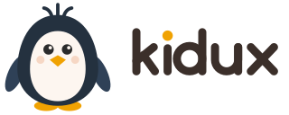
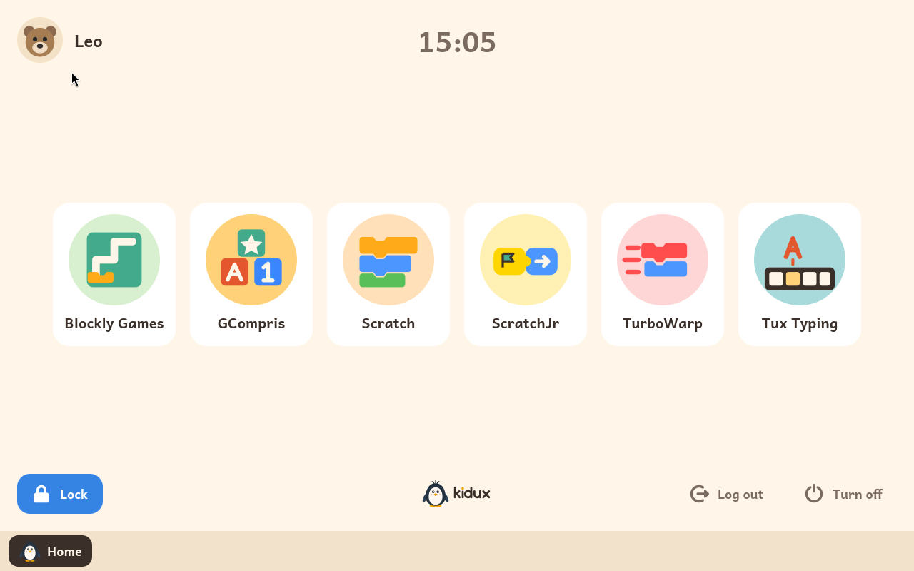

  <a href="https://kidux.org/"><b>kidux.org</b></a> ·
  <a href="README.es.md">Versión en español</a>

**Kidux is a Linux for a child's first computer.** Install it on any 64-bit
computer, old or new, and hand the computer over. The child gets a machine
that is theirs: their own name and picture on the sign-in screen, their own
password, their own language, and only what an adult has decided they may
use, for as long as the adult has decided.

Kidux is free for families and its code is published, built on Debian, in
English and Spanish.

## What a child sees

The computer starts on a sign-in screen with each child's picture. A child
taps their picture, types their password, and is inside. There is no
desktop, no settings and no way out: the screen belongs to the child, and
everything on it is something an adult chose.

Inside, the child's screen shows the learning modules an adult has
switched on for them, one tile each. A module can work in one of two ways.
An adult chooses which, for each child:

- **Full screen.** This is how every child starts. Each module fills the
  screen above a bar along the bottom. The bar takes the child home again,
  or to any other module they have open, and closes the module on screen.
  Several modules can be open at once, as on any computer, and the child
  moves between them from the bar or with the keyboard.
- **Windows.** For an older child, an adult can switch windows on. Then the
  modules open in windows with a frame and its buttons, several in view at
  once, to move, resize, minimise and maximise, as on any computer. The bar
  along the bottom becomes the list of open windows.

When the child's time for the day is over, the screen locks. Nothing is
lost: what the child was doing waits underneath. An adult can give more
time, let the child save their work, or end the session. The child can lock
the screen themselves whenever they step away, and a session left alone
for a few minutes, or a laptop whose lid is closed, locks by itself. The
child can always turn the computer off.

Brothers and sisters take turns. One signs out, the next signs in, each
with their own password, language and settings.

## What an adult decides

Everything, from one place: an adult panel that opens with the adult
password from the sign-in screen or from the lock screen, and from nowhere
else.

From the panel, an adult:

- adds children, and chooses each child's picture, language, keyboard and
  password;
- decides how each child may use the computer:
  - **whenever they like**;
  - **a set time each day**, counted while the session is unlocked and
    reset early every morning; or
  - **only when an adult says so**, with time given case by case;
- for the first two, chooses on which days of the week: only at the
  weekend, for instance;
- gives more time, or sets what is left of today to any number of
  minutes, none included, at any moment;
- switches windows on or off for each child;
- chooses after how many minutes a session left alone locks itself, and the
  screen turns off;
- adds and removes learning modules, and switches each one on for each
  child.

The adult password is never typed inside a child's session, so nothing a
child does on the computer can ever capture it.

## Learning modules

Everything a child does on Kidux is a learning module. An adult adds
modules from the adult panel and switches each one on for each child. The
panel says, of each module, the ages it is meant for and the modules best
done before it.

The modules Kidux offers:

- [GCompris](https://gcompris.net/): over a hundred activities for
  children from two to ten, about reading, counting, colours, the keyboard
  and the mouse.
- [Tux Typing](https://github.com/tux4kids/tuxtype): a typing course for
  children from six to twelve, catching falling letters and words by
  typing them.
- [ScratchJr](https://www.scratchjr.org/): Scratch for the youngest, from
  five to seven, with picture blocks and no words to read.
- [Blockly Games](https://blockly.games/): puzzles that teach programming
  with blocks one step at a time, for children who read a little, without
  the internet.
- [Scratch](https://scratch.mit.edu/): the editor children use at school to
  make games and stories with blocks, for children from eight up, on the
  computer itself, without the Scratch website's community.
- [TurboWarp](https://turbowarp.org/): Scratch made faster, the same blocks
  and the same projects, for a slower computer.
- BASIC: the language of the first home computers, through
  [wwwBASIC](https://github.com/google/wwwbasic), with a guide beside it
  for children from eight who read well, without the internet.

## Getting Kidux

There are two ways to install Kidux:

- **From the Kidux image. Coming soon.** Download the image, write it to a
  USB stick, an SD card or any other external drive, start the computer
  from it and follow the steps on the screen.
- **On Debian.** Install a Debian 13 with nothing else on it, add Kidux's
  package archive and install Kidux from it. The user guide has
  [every step](docs/en/user-guide.md#2-installing-kidux).

## Documentation

- [User guide](docs/en/user-guide.md), also [in Spanish](docs/es/user-guide.md):
  installing, the first start, and every screen an adult or a child will
  meet.
- [Developer documentation](docs/dev/README.md): how Kidux is built, how it
  works inside, and how to make a learning module.

## Supporting Kidux

Kidux is free for families. Keeping it going is not: a donation pays for
the time to build it and for testing it on real computers.

## Name and licence

*Kidux* is *kid* and *Tux*, the Linux penguin. The visual identity is in
[branding/](branding/README.md).

Kidux is developed by [Antonio Morales García](https://antonio.mg). Its own
code, images and documents are published under the **Business Source
License 1.1**; the full text, with its terms for Kidux, is in
[LICENSE](LICENSE). Copyright (C) 2026 Antonio Morales García. In short:
anyone may read the code, change it and pass it on; a family may use Kidux
at home, on the computers of the children in their care, for free; an
organisation, such as a school or an academy, needs a licence, which
[info@kidux.org](mailto:info@kidux.org) grants; and four years after each
version is published, that version becomes free software under the GNU
General Public License, version 3 or later. The name Kidux and the penguin
are not covered by the licence.

Kidux is a Debian derivative and installs software written by other people
under their own licences, which each component keeps: Debian's packages,
and the learning modules' programs, Scratch (AGPL-3), TurboWarp (GPL-3),
ScratchJr (BSD-3), Blockly Games (Apache-2.0), wwwBASIC (Apache-2.0),
GCompris (GPL-3) and Tux Typing (GPL-2). The source of each program Kidux builds, with the changes
it is built with, is published beside the build.
