# Kidux user guide

*[Versión en español](../es/user-guide.md)*

This guide is for the adult who looks after a Kidux computer. Children do
not need a guide: every screen they can reach explains itself.

## 1. What you need

- A computer with a **64-bit processor**. Almost any PC or laptop made from
  2008 onwards has one.
- At least **2 GB of memory**. 4 GB is better.
- **32 GB of disk**, and the whole disk. Kidux keeps the system on one part
  of the disk and the children's work on another. That way the system can
  be updated, or even reinstalled, without touching anything the children
  have made.

## 2. Installing Kidux

There are two ways to put Kidux on a computer.

### From the Kidux image

**Coming soon.** Kidux will have an image of its own that installs
everything by itself: download the image, write it to a USB stick, an SD
card or any other external drive, start the computer from it, and follow
the steps on the screen.

### On Debian

Kidux is built on [Debian](https://www.debian.org/) and installs on top of
a Debian 13 that has nothing else on it. It takes about an hour, most of
it waiting. Some of it is typed at a text console; every line to type is
written here.

Everything on the computer's disk is erased. Copy anything you want to
keep somewhere else first.

1. **Download Debian.** On another computer, go to
   [debian.org/download](https://www.debian.org/download) and download the
   small installation image, a file named like
   `debian-13.x.0-amd64-netinst.iso`.

2. **Write it to a USB stick** of 1 GB or more, with a program such as
   [balenaEtcher](https://etcher.balena.io/): choose the file, choose the
   stick, write. Everything on the stick is erased.

3. **Start the computer from the stick.** Plug the stick in, and a network
   cable too if the computer has a socket for one. Turn the computer on
   and open its boot menu: usually F12, F11, F8, Esc or F2 pressed just
   after turning it on, or the Option key held down on a Mac. Choose the
   stick, and then **Graphical install**.

   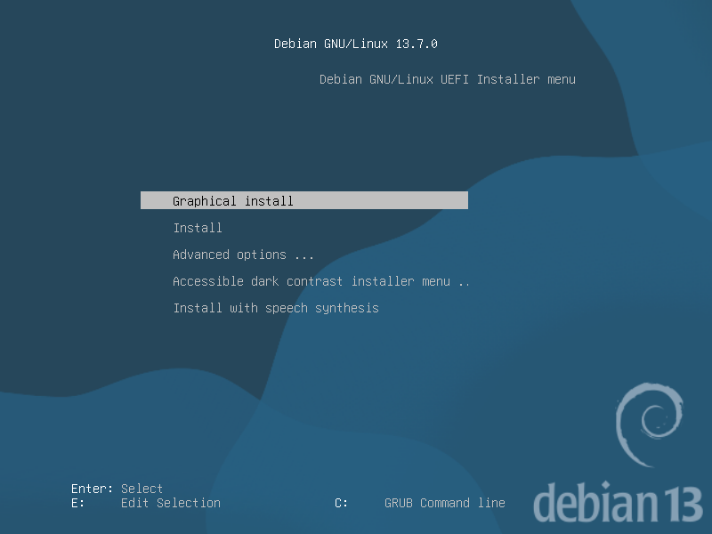

4. **Answer the installer.** It asks one thing at a time, and **Continue**
   moves on. Most of it can be left as it comes. These are the questions
   that matter to Kidux:

   | The installer asks | Answer |
   |---|---|
   | Language, location, keyboard | Your own. Kidux asks for its own language and keyboard at its first start. |
   | Network | With a cable it asks nothing. Without one, choose your Wi-Fi and type its password. |
   | Hostname and domain name | Any name, `kidux` for instance. Leave the domain empty. |
   | Root password | Leave both boxes **empty**. The user created next can then look after the computer. |
   | Full name, username and password | An account for you, the adult. The children get theirs in Kidux. |
   | Partition disks | **Guided - use entire disk**, the computer's disk, and **Separate /home partition**: the system on one part of the disk and the children's work on another. Then **Finish partitioning and write changes to disk**, and **Yes** when it asks whether to write the changes; **No** comes ticked. |
   | Debian mirror, proxy, package survey | What comes chosen. |
   | Software selection | Untick **Debian desktop environment** and **GNOME**, and leave only **standard system utilities** ticked. No desktop: Kidux brings its own screens. |
   | GRUB boot loader | Only an older computer is asked. **Yes**, on the computer's own disk. |

   The root password, left empty:

   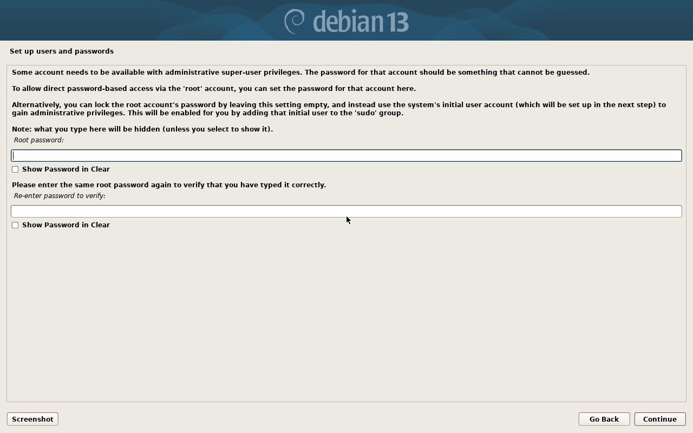

   The partitioning scheme:

   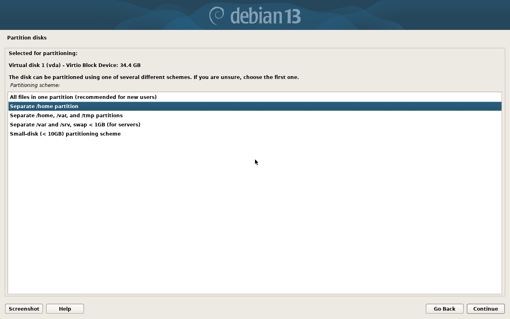

   And the software: the standard utilities alone.

   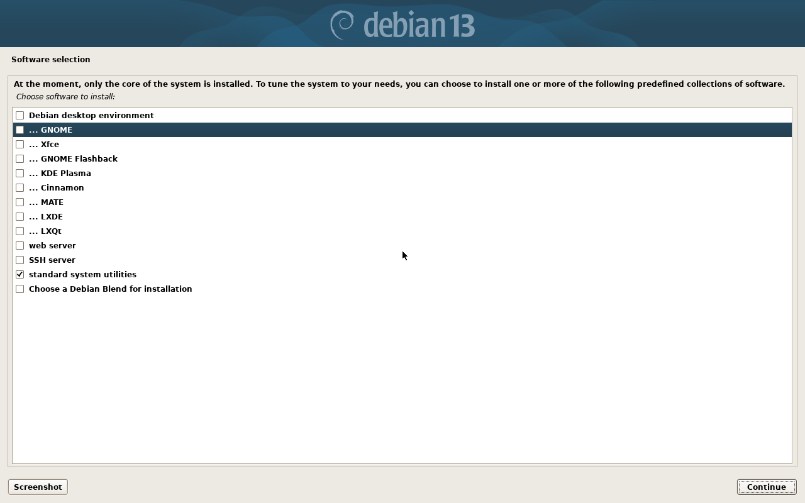

   When the installer finishes, take the stick out and let the computer
   restart.

5. **Sign in to Debian.** The computer starts on a text screen that asks
   for a login. Type the user name and the password given to the
   installer.

6. **Install Kidux.** Type these lines, one at a time. The first three
   fetch and install the address Kidux's packages come from and the key
   they are signed with; the last two install Kidux.

   ```
   wget https://kidux.org/apt/bootstrap/stable/kidux-archive-keyring.deb
   wget https://kidux.org/apt/bootstrap/stable/kidux-apt-source.deb
   sudo apt install ./kidux-archive-keyring.deb ./kidux-apt-source.deb
   sudo apt update
   sudo apt install kidux-base
   ```

   The first line that starts with `sudo` asks for your password. The last
   shows what it is about to install and asks whether to go on: press
   Enter. It takes a few minutes.

   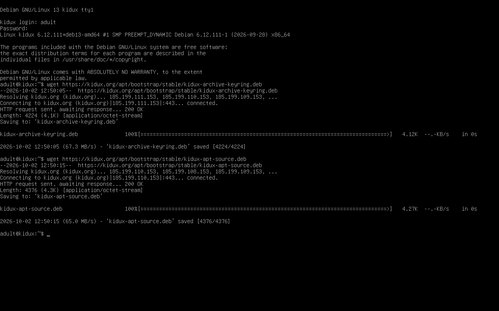

7. **If the computer is on Wi-Fi, hand the Wi-Fi over to Kidux.** With a
   network cable, skip this step.

   The Debian installer wrote the Wi-Fi it joined into a file of its own,
   `/etc/network/interfaces`. Kidux's adult panel has a **Network** page
   to join and change Wi-Fi networks, and it cannot change one that is
   written in that file. So take it out of the file now.

   Open the file:

   ```
   sudo nano /etc/network/interfaces
   ```

   It looks like this, with the name of your Wi-Fi card, which starts with
   `wl`, and of your network:

   ```
   # This file describes the network interfaces available on your system
   # and how to activate them. For more information, see interfaces(5).

   source /etc/network/interfaces.d/*

   # The loopback network interface
   auto lo
   iface lo inet loopback

   # The primary network interface
   allow-hotplug wlp3s0
   iface wlp3s0 inet dhcp
           wpa-ssid MyNetwork
           wpa-psk  its-password
   ```

   Delete the lines that name the Wi-Fi card, those that start with
   `allow-hotplug` and `iface`, and the lines under them that start with
   `wpa-`. Leave the rest as it is:

   ```
   # This file describes the network interfaces available on your system
   # and how to activate them. For more information, see interfaces(5).

   source /etc/network/interfaces.d/*

   # The loopback network interface
   auto lo
   iface lo inet loopback
   ```

   Save with Ctrl+O and Enter, and leave with Ctrl+X.

8. **Restart.**

   ```
   sudo reboot
   ```

   The computer shows Kidux's logo and starts for the first time, which
   the next section describes. With the Wi-Fi taken out of the file, the
   computer is on no network until it is joined again from the adult
   panel's **Network** page, section 8.

## 3. The first start

Every time the computer starts, it shows the Kidux logo until the first
screen is ready.


The first time the computer starts, it sets itself up with you. It takes a
few minutes. Nothing needs a keyboard shortcut or a terminal: it is five
screens, one after the other.

1. **Language.** Choose the language of the computer. Each language is
   written in its own words, so you can find yours whatever language the
   screen is in.

   

2. **Keyboard.** Choose the keyboard your computer has. The screen restarts
   by itself to use it. From now on, every password is typed on this
   keyboard, on every screen that asks for one.

   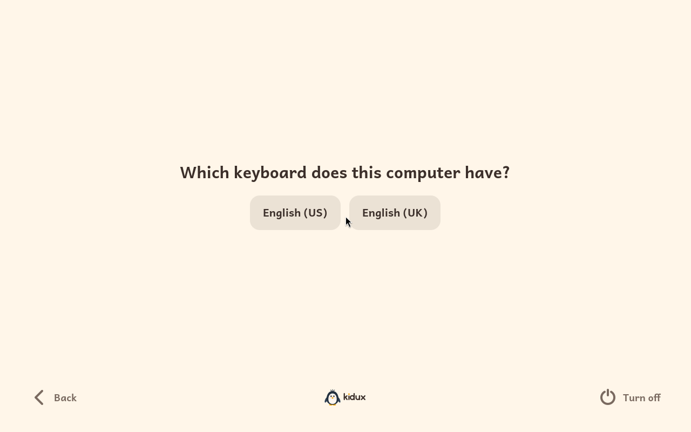

3. **The adult password.** Type it twice. This password opens the adult
   panel, where you decide everything about the children. Choose one the
   children will not guess, and do not let them see you type it. There is
   no rule about its length or its characters. A longer one is simply
   harder to guess.

   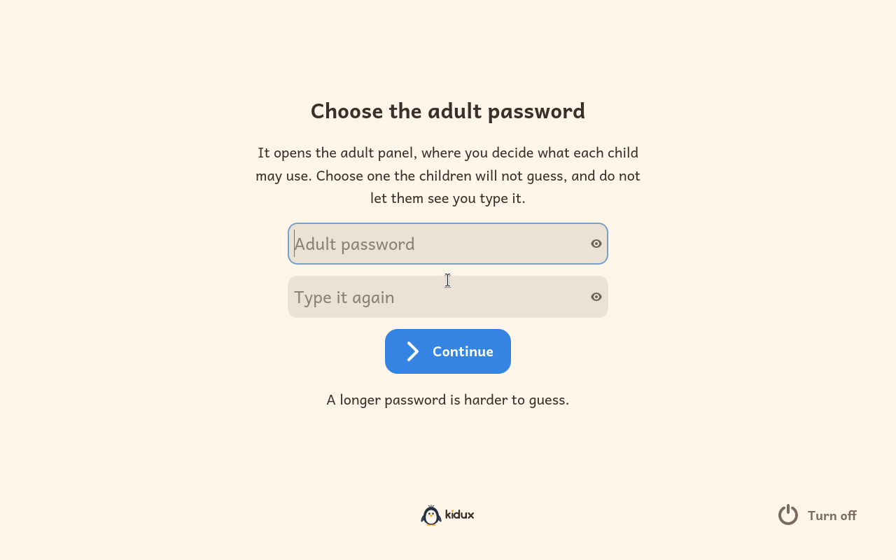

4. **The first child.** Everything about the child is on one screen:

   - their name;
   - a picture they will recognise themselves by;
   - their language;
   - their own password, typed twice. For a young child it can be very
     simple;
   - how they may use the computer (section 6). It starts at an hour a
     day.

   A name and a password are enough. Press **Add**.

   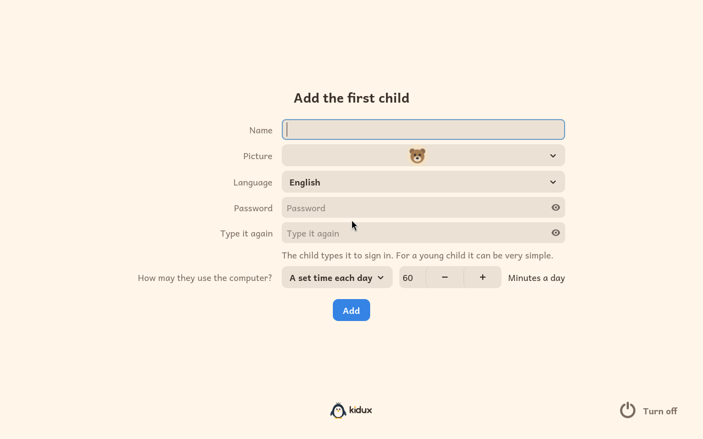

5. **Ready.** The sign-in screen appears, with the child's picture on it.
   Everything can be changed later from the adult panel, and more children
   can be added there.

   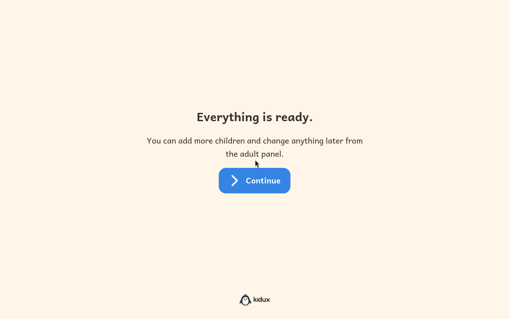

## 4. The sign-in screen

The computer always starts here. It also comes back here when a child
signs out.

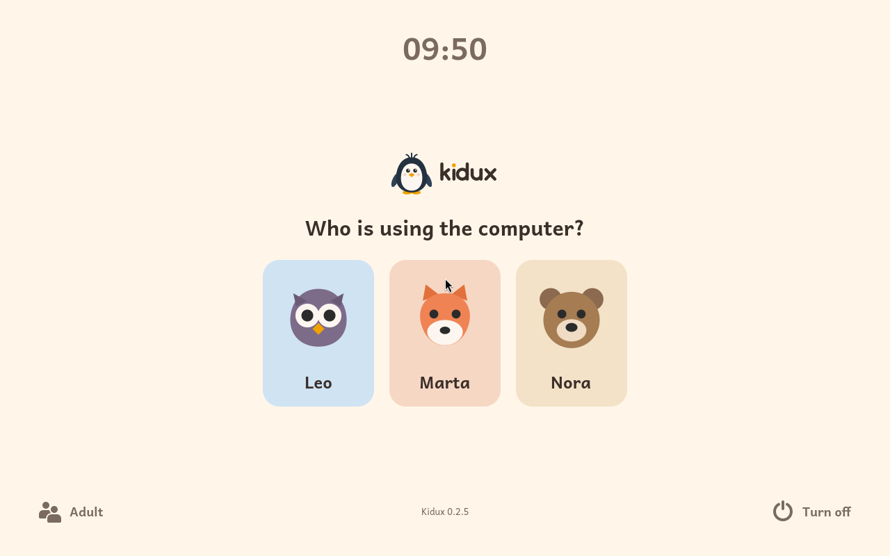

Each child has their own picture and name. To sign in, a child taps their
picture and types their password. The moment a picture is tapped, the
screen changes to that child's language. Two children with different
languages each see their own.

At the bottom of the screen, in small letters, the screen says which Kidux
this is: **Kidux 0.2.3**, for instance. After an update, the number
changes. The lock screen says it too, under the logo.

On a laptop, the top right corner shows the battery, the sound, the
keyboard's light and the screen's brightness, just as a child's screen does
(section 5). The corner is there on this screen, on the lock screen and on
the adult's screens alike. The laptop's own keys for those things work on
all of them too.


A wrong password is never a telling-off. The screen says that the password
is not right, and lets the child try again.

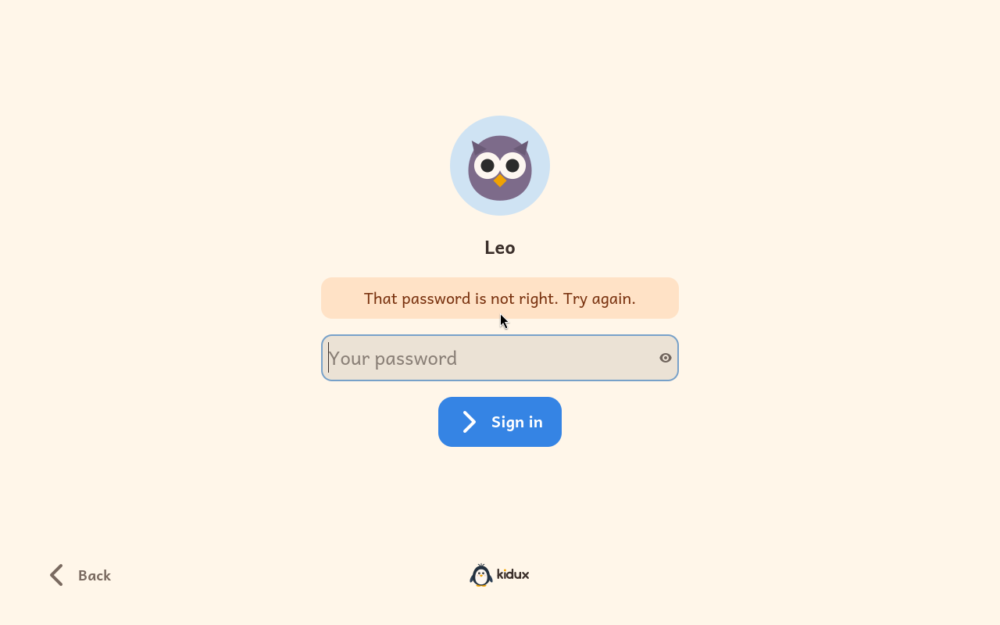

If the child has used all their time for the day, the screen says so and
offers **Ask an adult for more time**. Tap it and type the adult password.
The screen then says how much time the child has left, and offers fifteen,
thirty or sixty minutes, or a number of your own. Choose one, and the child
is in.

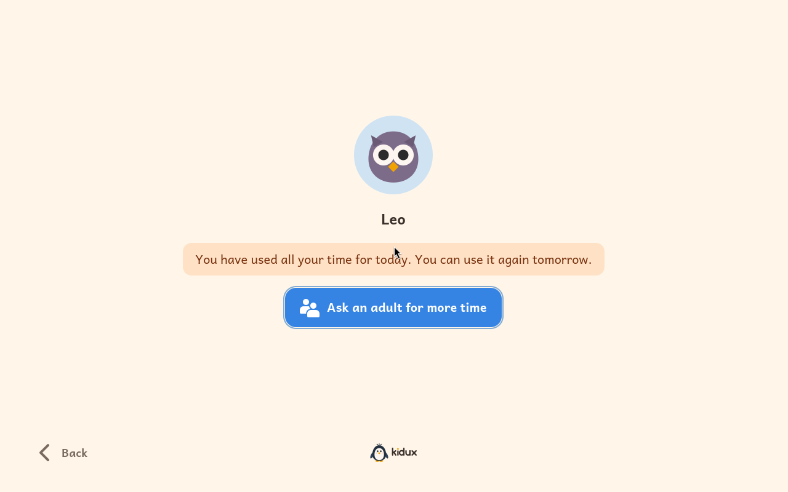

On a day of the week that is not the child's (section 6), the screen says
that the computer is not for them today, and offers the same **Ask an adult
for more time**.

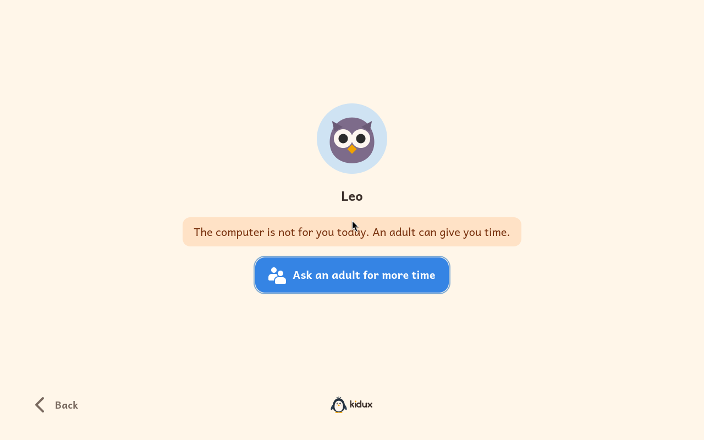

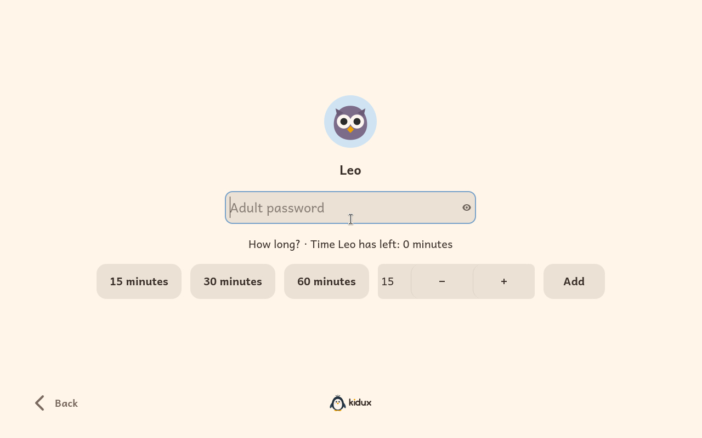

Two more buttons live in the corners of the screen:

- **Adult**, bottom left, asks for the adult password and opens the adult
  panel.
- **Turn off**, bottom right, asks once and then turns the computer off or
  restarts it. A child may always do this.

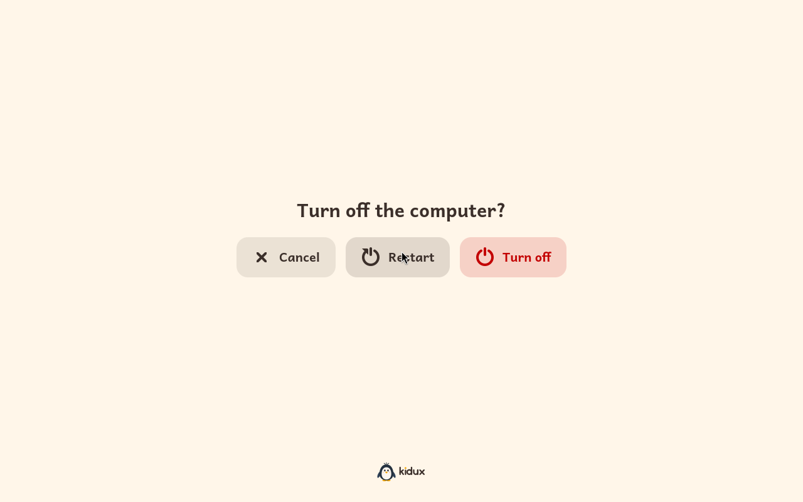

## 5. A child's session

### The child's screen

Once inside, the child sees their own screen and nothing else. On it:

- their picture and their name;
- the clock;
- how much time is left today, when their time is limited: an hourglass
  and the hours and minutes, **00:51** for instance. Resting the pointer
  on it, or tapping it, says it in words: *51 minutes left*;
- the learning modules an adult has switched on for them, one tile each.

On a laptop, the top right corner also shows what the machine has: the
battery and its charge, and the sound, the keyboard's light and the
screen's brightness. Each of those three is a button that opens a slider.
The sound's slider has **Mute** under it. A computer without one of these
things simply does not show it.

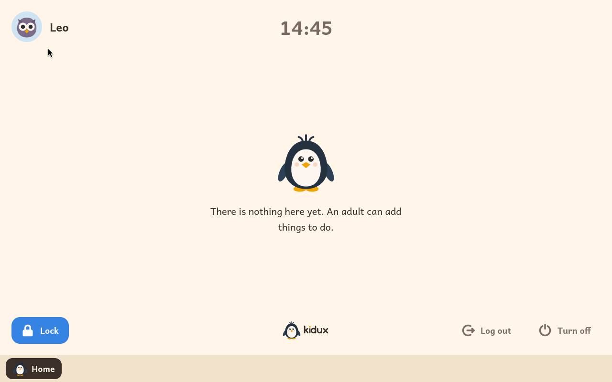

### Opening a module

Each module switched on for the child is a tile, with its picture and its
name in the child's language. The child opens one by tapping it. It also
works from the keyboard: Tab to the tiles, the arrows to the one they want,
and Enter.

When there are more tiles than fit on the screen, a bar appears on the
right, and a shade along the bottom shows that there are more tiles below.

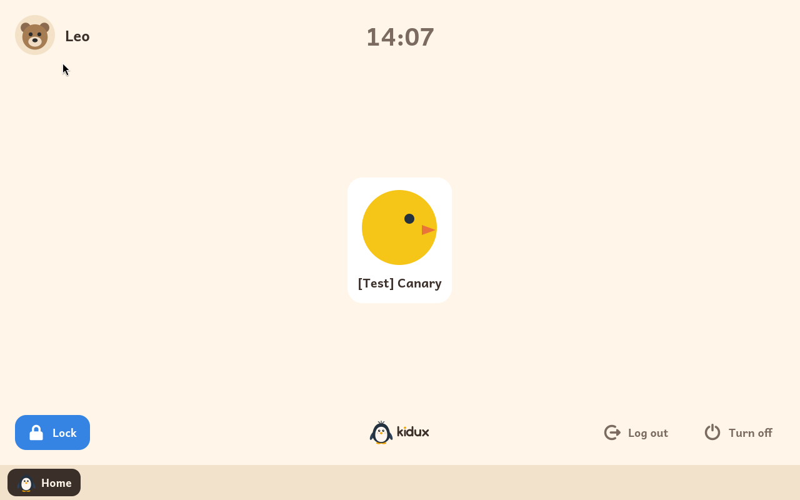

A module opens filling the screen above a bar that stays along the bottom.
Several modules can be open at once, and the child moves between them as
on any computer. Tapping the tile of a module that is already open goes to
it, rather than opening it twice.

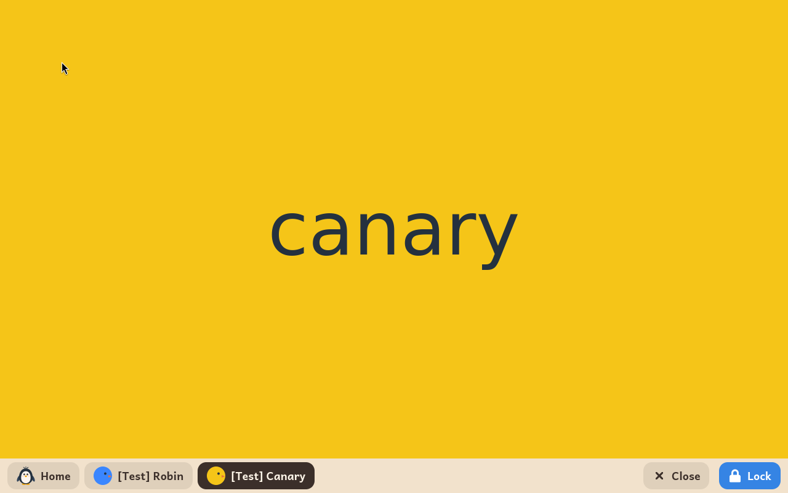

### The bar

The bar along the bottom always has:

- **Home**, which brings back the child's screen;
- a button for each open module, with the one on screen marked. The
  buttons use all the room between **Home** and the time left.

While a module is on screen, the bar also shows the time left (the
hourglass), **Close** and **Lock**.

**Close** closes the module on screen. The module is asked first, as any
program is when its window is closed, so that a module with unsaved work
can say so. If the module is still open ten seconds later, the bar asks
whether to close it anyway:

- **Cancel** leaves it open;
- **Close it anyway** closes it. Whatever was not saved is lost.

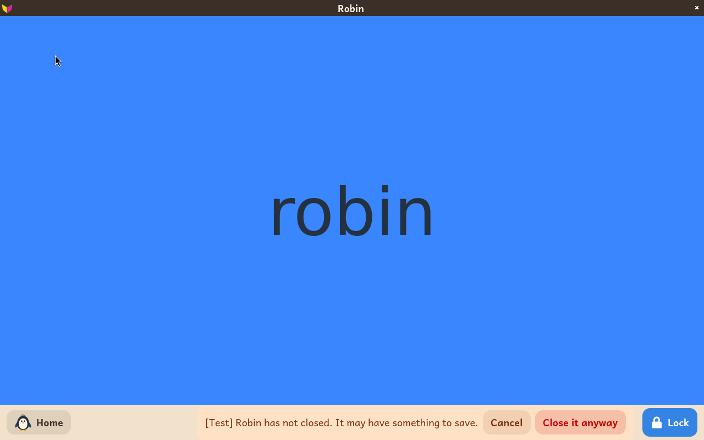

### The keyboard

A few keys do what the bar's buttons do:

- The **Windows key** (the one with the logo; **⌘** on a Mac keyboard),
  pressed on its own, goes home.
- **Alt+Tab** goes round the open modules, in the order they are on the
  bar: to the next one to the right of the module on screen, and from the
  last one back to the first. From the child's screen it goes to the
  first. Holding **Alt** down, each press of **Tab** lights the next one
  on the bar, and letting go of **Alt** goes to the one lit.
  **Alt+Shift+Tab** goes round the other way. Alt+Tab never goes to the
  child's screen: that is the Windows key's job. With only one module
  open, and on screen, it does nothing.
- **Alt+F4** is **Close**. Pressed again while the bar is asking, it
  closes the module anyway.

Resting the pointer on a button of the bar says the key that does the
same thing, so the child can learn them. On a Mac, where F4 needs the fn
key, **Close** says **Alt+(fn)F4**. The module Alt+Tab would go to says
**Alt+Tab**.

### A laptop's own keys and its lid

A laptop's own keys for the screen's brightness, the keyboard's light and
the sound (louder, quieter and mute) do what they say, inside any module.
The corner of the child's screen shows the new level at once.

Closing the lid locks the child's session and turns the screen off.
Opening it turns the screen back on, on the lock screen, where the child
types their password to carry on. Time does not count while the lid is
closed.

The same keys work on the sign-in screen and on the lock screen, and
closing the lid there turns the screen off too.

### Files, locking and logging out

A file the child makes in one module is kept in the child's own folders,
where any other module can open it.

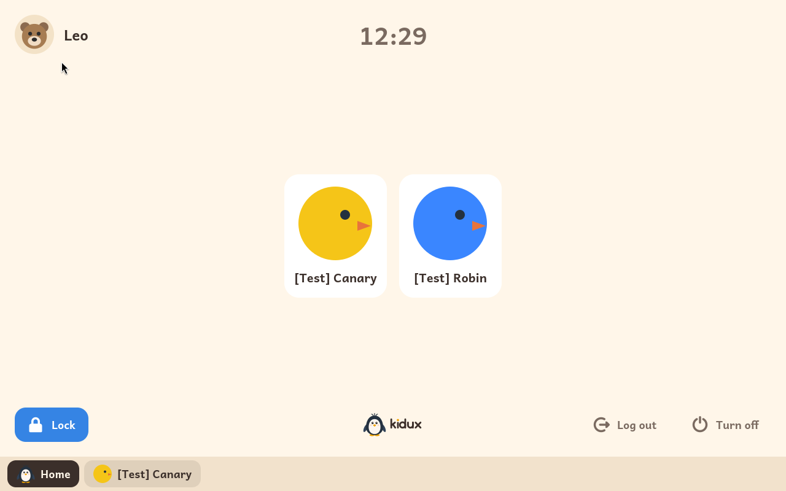

Three buttons sit at the bottom of the child's screen:

- **Lock**, bottom left, locks the screen straight away. This is how a
  child steps away without spending time: time does not count while the
  screen is locked, and everything stays exactly as it was.
- **Log out** ends the session and brings back the sign-in screen. It asks
  first whether the child's work is saved, because logging out closes
  every module.
- **Turn off** brings up the lock screen, where the computer can be turned
  off.

A session left alone locks itself too: after five minutes without anyone
touching the keyboard or the mouse, as a screensaver would, and a module
that plays on its own is no exception. After ten minutes the screen turns
off, on every screen of the computer, the sign-in and lock screens
included, and the first touch turns it on again. An adult can change both
times on the adult panel's **System** page (section 8).

Locking the screen leaves every module exactly where it was. Logging out,
from the child's screen or from the lock screen, closes every module with
the session, so it is worth saving first.

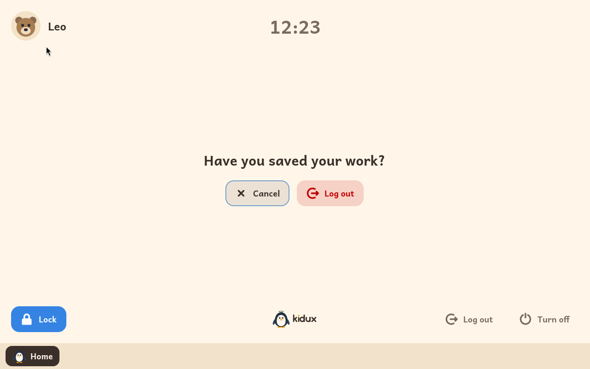

### When time is about to run out

Ten, five and one minute before the child's time runs out, a message on
the screen tells them to save their work. When the time runs out, the lock
screen comes up by itself.

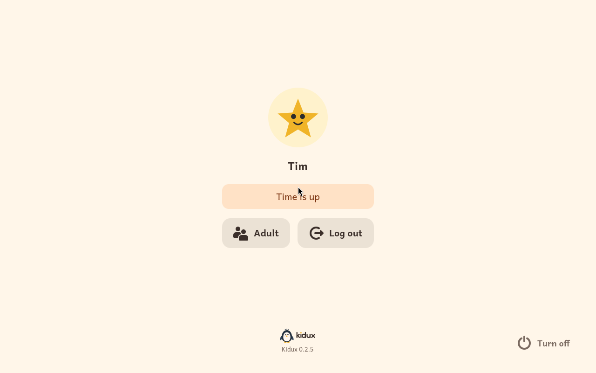

## 6. Time

Each child uses the computer in one of three ways. An adult chooses which:

- **Whenever they like.** There is no limit. The computer still counts how
  long the child spends, so an adult can see it.
- **A set time each day.** So many minutes a day. Time counts while the
  session is unlocked, whether or not the child is doing anything, and it
  stops while the screen is locked. The day starts again at four in the
  morning, not at midnight, so that an evening session is not cut in two.
  Extra time an adult gives on such a day lasts until the day ends.
- **Only when an adult says so.** The child cannot sign in until an adult
  gives them time, on the sign-in screen. Time given this way is kept until
  it is used, even across days.

The first two ways apply on the **days** of the week an adult ticks. For a
new child, every day is ticked. On the other days the computer is not the
child's: they cannot sign in unless an adult gives them time, and that time
lasts until the day ends. A child still using the computer when such a day
begins, at four in the morning, finds the screen locked, just as when their
time runs out.

Two things worth knowing:

- Time counts while the session is unlocked. A session left open over
  dinner spends the day's time. The child should lock the screen whenever
  they step away.
- Time already spent is remembered through a restart, a power cut or a
  crash.

## 7. The lock screen

The lock screen comes up over a child's session when their time runs out,
when the child locks the screen, when the session is left alone for a few
minutes, when a laptop's lid is closed, and whenever anyone presses the
computer's power button. What the child was doing stays exactly as it
was, underneath, and nothing of theirs keeps running.

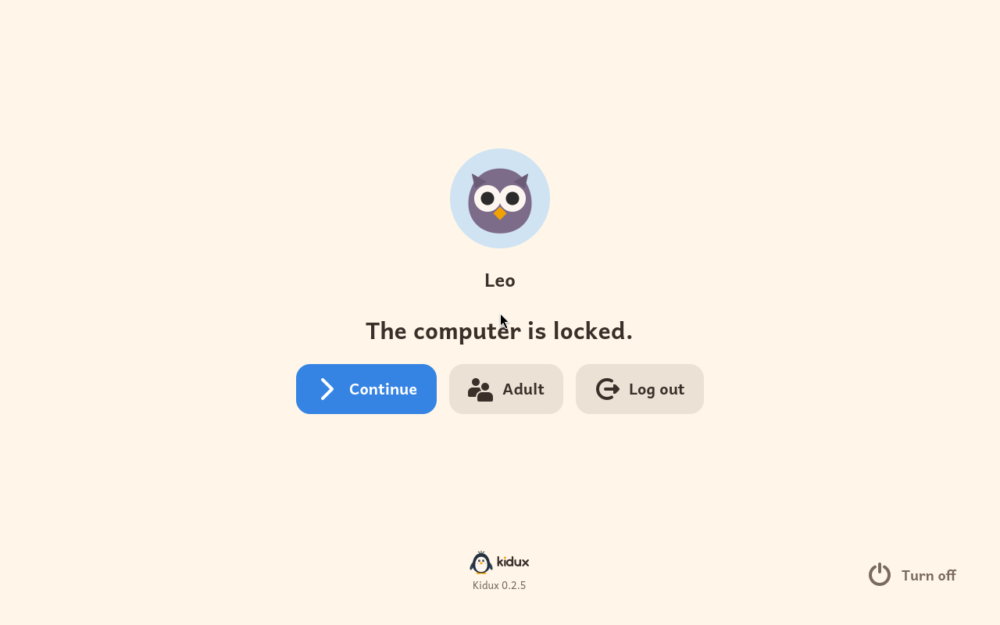

The lock screen offers four things:

- **Continue.** The child types their own password and carries on, as long
  as they still have time.
- **Adult.** The adult password, and then one of four choices:
  - **give more time**, with how much the child has left in view;
  - **unlock to save work**, which unlocks the screen for a few minutes
    without counting them, so that the child can save and lock again;
  - **log out**, which ends the session;
  - the **adult panel** (section 8).
- **Log out.** The child types their own password and the session ends.
- **Turn off.** It asks once, then turns the computer off.

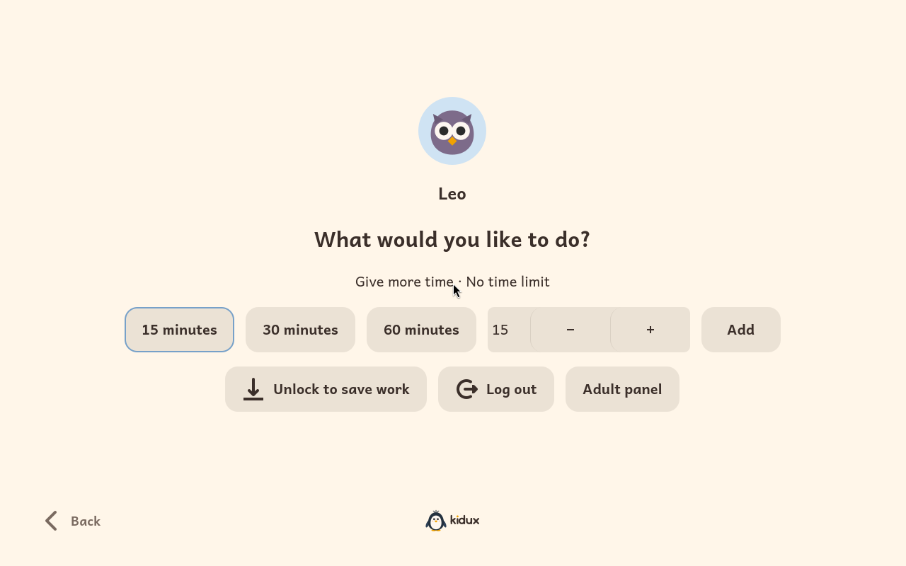

The power button never turns the computer off by itself. It always brings
up this screen. That way, a password is only ever typed on a screen that is
genuinely Kidux's, and never on something a child's program has drawn to
look like it.

## 8. The adult panel

### Opening and closing it

Press **Adult** on the sign-in screen, or **Adult** and then **Adult
panel** on the lock screen, and type the adult password. The panel covers
the whole screen. It closes with **Close**, with the Escape key, or by
itself after five minutes without a touch, or the minutes set on the
**System** page for a computer left alone. Nobody can leave it open by
mistake.

One habit keeps the adult password yours: **press the computer's power
button before typing it**, whenever a child has been using the computer.
The power button always brings up the lock screen, which is Kidux's own.
So the screen you then type on is never something a child's program has
drawn.

The panel has four pages: **Children**, **Modules**, **System** and
**Network**. Each page fits on one screen, and everything is changed in
place, without going from one screen to another.

When a page holds more than the screen does, with many children or many
modules, or on a small screen, a bar appears on its right, or along its
bottom, and a shade appears on the edge where the page goes on. Drag the
bar, or scroll, to see the rest. Every screen of Kidux does the same.

### Children

Across the top of the page, every child, with the chosen one marked, and
**Add a child**.

Below, the chosen child's time:

- how much time they have used today;
- buttons to **give more time** straight away;
- **Left today**: how many minutes they have left. You can change it to
  any number, zero included, and press **Set**. Setting it to zero ends
  their time now, even while they are using the computer: the lock screen
  comes up at once.

Below that, everything about the child:

- their name;
- their picture;
- their language;
- a new password, if you want to change it;
- how they may use the computer (section 6), and the **days** of the week
  that applies to, Monday to Sunday;
- **Windows**, explained below.

Change what you like and press **Save**. Anything that cannot be saved is
marked where it is, and the rest is saved. **Add a child** shows the same
page, empty.

**Remove** asks once, on the same page. Removing a child deletes their
account and everything in it. **Remove, but keep their files** deletes the
account but leaves the child's files on the computer. A child who is signed
in cannot be removed until they log out.

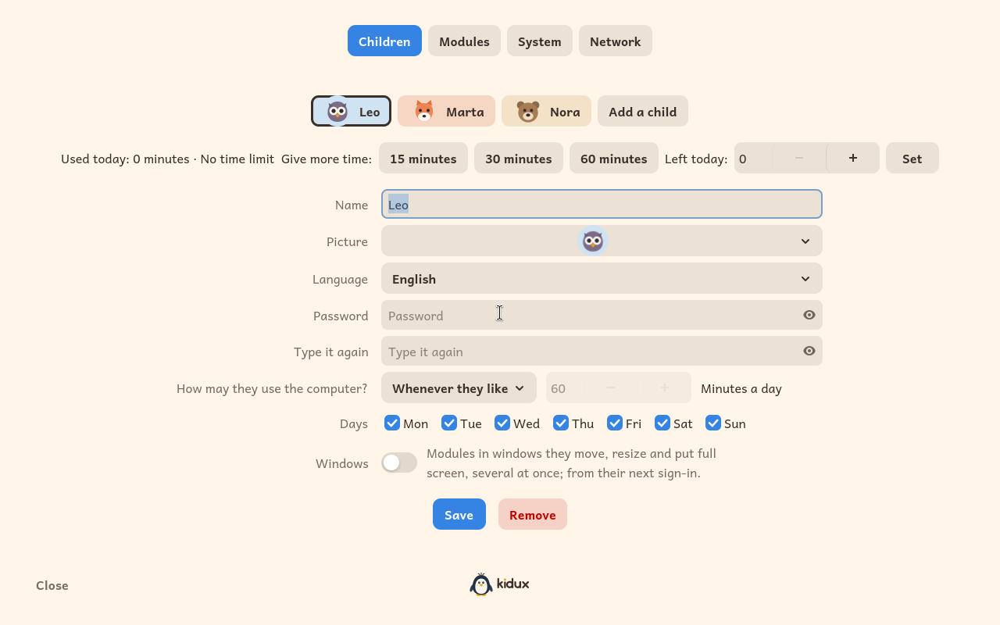

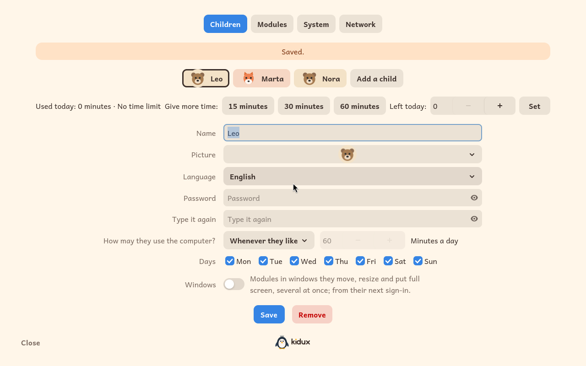

### Windows

**Windows** is off for a new child. Then each learning module fills the
screen above the bar, which is the simplest for a young child.

With **Windows** switched on, the child's modules open in windows, several
at once, as on any computer:

- each window has a title bar to move it by, edges to resize it by, and
  buttons to minimise, maximise and close it;
- what is copied in one window can be pasted in another;
- the bar has a button for each window, with the one in use marked and a
  minimised one paler. Tapping a button brings its window forward. When
  there are more buttons than fit, an arrow at either end of them brings
  the others into view;
- **Home**, and the Windows key, show the desk: every window minimised and
  the child's tiles in view. Tapping a tile, or a window's button on the
  bar, brings the windows back as they were, with the one asked for in
  front. A window the child minimised stays minimised.

The change applies the next time the child signs in.

Some learning modules, a real web browser for instance, only work with
windows. They say so on the **Modules** page, where they cannot be switched
on for a child without windows.

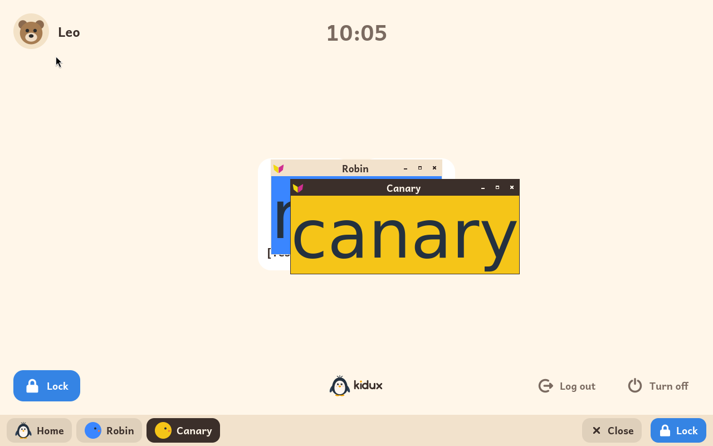

### Modules

The **Modules** page lists every learning module installed on the
computer, with its name and what it is for. Beside the name, in smaller
letters, are the ages the module is meant for and the module's version.
Under it, when there are any, **Recommended before:** names the modules
best done first. That is advice: any module can be switched on for any
child.

Both lists go from the modules for the youngest children to those for the
oldest, and the modules whose names begin with **[Test]** come last. The
box at the top, **Find a module**, narrows both lists to the modules whose
name or description has what you type in it.

Each module has a switch for each child, under the child's picture. A
switch is saved as soon as you flip it, and the child's screen follows it
straight away, even while they are using the computer.

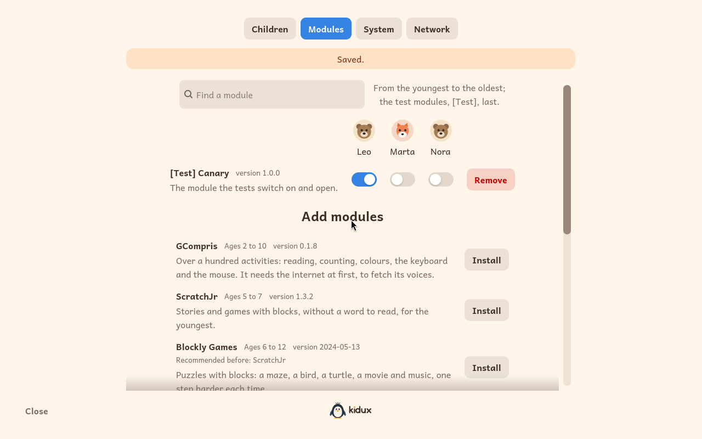

Under the installed modules, **Add modules** lists the learning modules
Kidux offers that are not on the computer yet, with the same ages and
modules to do first.

- **Install** adds one. The page shows how far it has got. The module then
  appears above, switched off for every child.
- **Settings**, in the row of a module that has some, opens what an adult
  can set in it for each child: one column for each child, and each
  setting with what it does written under it. A change is saved as soon
  as it is made. BASIC's is *Type it in for me*: switched off, the child
  types every program of the guide.
- **Remove**, at the end of an installed module's row, asks once and takes
  the module off the computer. What each child made with it stays in their
  own folders, and what the module kept for each child, such as their
  progress and settings, stays too: installed again, it finds them.
- **Look for modules** asks Kidux for what it offers now. It needs an
  internet connection.

Modules are installed and removed only while no child is signed in, so
that nothing a child is using changes under them.

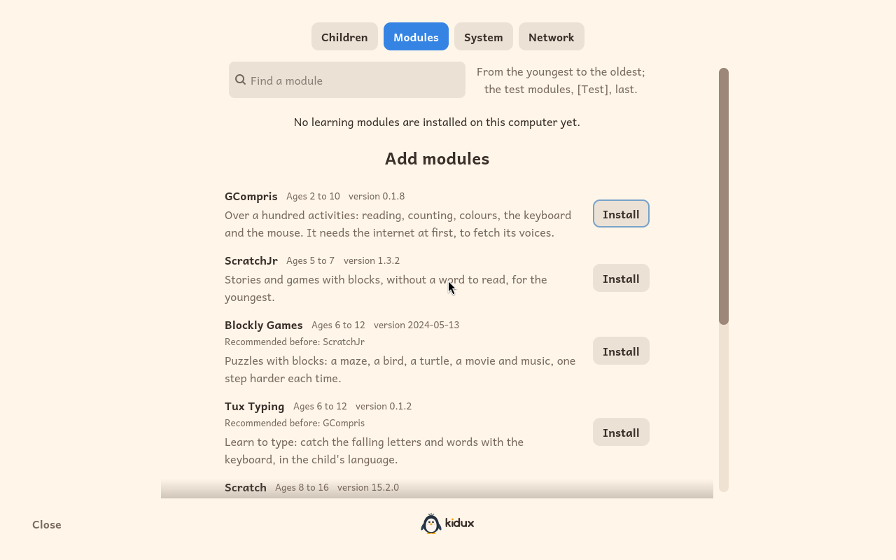

### System

The **System** page holds, from top to bottom:

- **The Kidux version**, and under it, smaller, the version of each of its
  parts. This is what to give anyone helping you find out what went wrong.
  Beside the version, the updates (section 10).
- **The recovery password.** It starts the computer another way from the
  boot menu, if Kidux ever fails to start (section 11). Write it down
  somewhere safe.
- **Changing the adult password**, by typing the current one and the new
  one twice.
- **The computer's language and keyboard.**
- **The size of everything on the screen.** It is **Automatic** until you
  choose, with the size that comes to in brackets: **Automatic
  (175 %\*)**, for instance. Automatic means as large as the screen allows
  with room to spare. Choose a smaller size for more room on a large
  screen, or a larger one to make everything bigger.

  The sizes marked with \* are not whole multiples of 100 %. A learning
  module made for X11, the older display system of Linux, can look blurred
  at one of them. If one does, choose a size without \*.
- **Left alone**: after how many minutes without a touch a child's
  session locks itself (five, to start with), which is also how long this
  panel stays open, and after how many any screen of the computer turns
  off (ten). Change either number, then press **Set**. The panel takes
  them at once; a child's session, the next time the child signs in.

The language, the keyboard and the size are saved as soon as you choose
them:

- on the sign-in screen, they apply when you close the panel: the screen
  starts again with them, which takes a moment;
- on the lock screen, they apply the next time a screen starts, since the
  lock screen cannot start again over a child's session;
- a child's screen takes them the next time the child signs in.

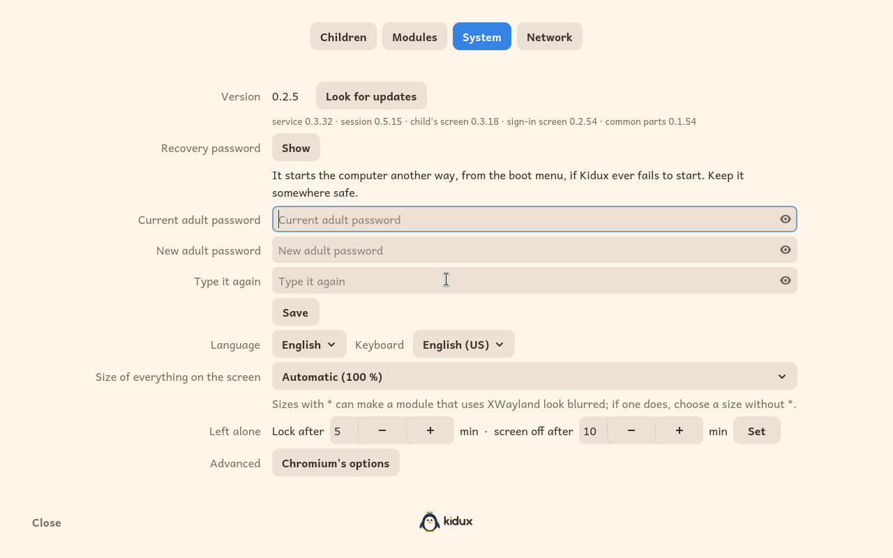

### Advanced

**Advanced**, at the end of the System page, is for when something does not
work on this particular computer.

**Chromium's options** are for a learning module made of web pages, or
ScratchJr, which has Chromium inside, that looks wrong on this computer's
screen, with patches of noise or old pictures in it, or a picture that
only changes when the pointer moves. An option written in the box, one a
line, changes how Chromium draws. It takes effect the next time the module
is opened.

Under the box, the page lists the options worth trying, in the order to try
them, each with what it does. Their letters can be selected and copied
into the box. Leave the box empty unless you know which option your
computer needs: empty is what Kidux does on its own.

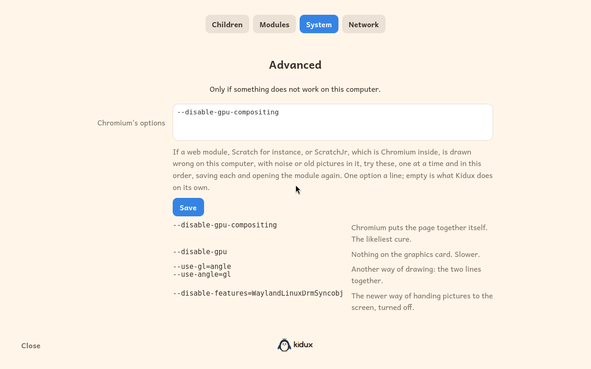

### Network

The **Network** page shows how this computer is connected:

- **Connection**: each connection on a line, Wi-Fi or cable, with the
  network's name, its signal and the computer's address, or **Not
  connected**.
- **Router**: whether the router, the box the connection goes through,
  answers.
- **Look again** asks the router again and looks for Wi-Fi networks anew.
  The page does this by itself when it opens.

When the computer's Wi-Fi can be changed from here, the Wi-Fi networks in
reach are listed under that, with the one in use first. Each shows its
signal, and a padlock if it has a password.

- **Connect** joins a network. When the network needs a password, the page
  asks for it on the same line. The computer keeps the password, and joins
  the network again by itself from then on, before anyone signs in.
- **Forget** makes the computer stop joining a network by itself. It asks
  first.

Changing network can leave the children's modules without a connection
for a moment.

The page can join a home or a café network, with or without a password. A
network at an office or a school that asks for a user name of its own
cannot be set up here.

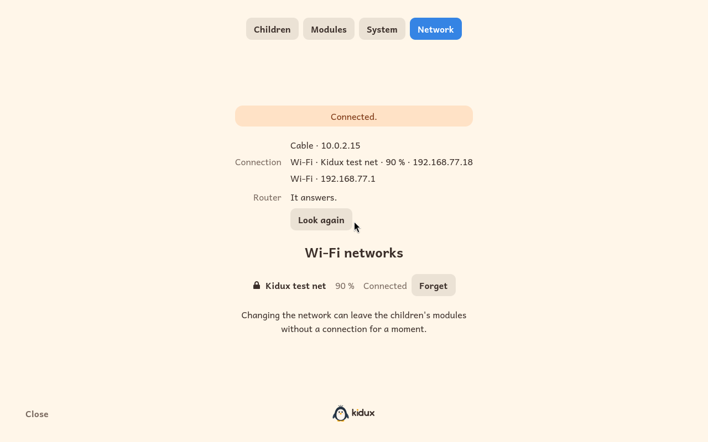

### A Wi-Fi set up when Debian was installed

If the Network page says that the Wi-Fi was set up when Debian was
installed, it shows the connection but cannot change it: the Debian
installer set the Wi-Fi up its own way. To change it from the page, hand
it over once. Do this at the computer itself, not from another computer
connected to it through that Wi-Fi.

1. Open a text console. Section 11 says how.

2. Open the installer's file:

   ```
   sudo nano /etc/network/interfaces
   ```

3. Find the lines that start with `allow-hotplug` or `iface` and name the
   Wi-Fi card. Its name starts with `wl`. Delete those lines, and the lines
   under them that start with `wpa-`. Save the file.

4. Restart the computer:

   ```
   sudo reboot
   ```

The installer's way of running the Wi-Fi ends with the restart. From then
on, Kidux runs the Wi-Fi card. When the sign-in screen is back, open the
adult panel, go to **Network**, and join the Wi-Fi from the page with its
password. From then on, the page changes it.

## 9. Learning modules

Each learning module is something a child can open from their screen. An
adult switches each module on for each child, on the adult panel's
**Modules** page (section 8).

Some modules are made of web pages. They open full screen above the bar,
in the Chromium web browser, with no address bar and no tabs, and only
ever show their own pages: a link out of them to anywhere else leads
nowhere. Chromium's own words, on the page it shows in place of a blocked
one or in its menus, are in the child's language. Chromium is a large
program, about 300 MB, which comes with the first module of this kind.

A few modules are a door to one website on the internet. They show that
site and nothing else of the internet: a link to any other site leads
nowhere, and Chromium shows a page saying it is blocked. Their names and
descriptions say which site they open and what it asks for, such as an
account or a subscription, so that an adult knows before switching one
on. They need the internet whenever they are used.

The modules whose names begin with **[Test]** are there to check that
Kidux works, not for a child to use.

### GCompris

**GCompris** is over a hundred activities for children from two to ten:
reading and writing, counting, colours and shapes, and learning to use the
keyboard and the mouse, each one a little game. It speaks the child's
language.

Its voices and some of its pictures are not on the computer at first.
GCompris fetches them by itself from the internet the first times it is
used, so it needs a connection then. It works without them until they have
arrived. The panel says so before GCompris is installed.

GCompris takes the whole screen above the bar. The bar's **Home** takes the
child back to their other things.

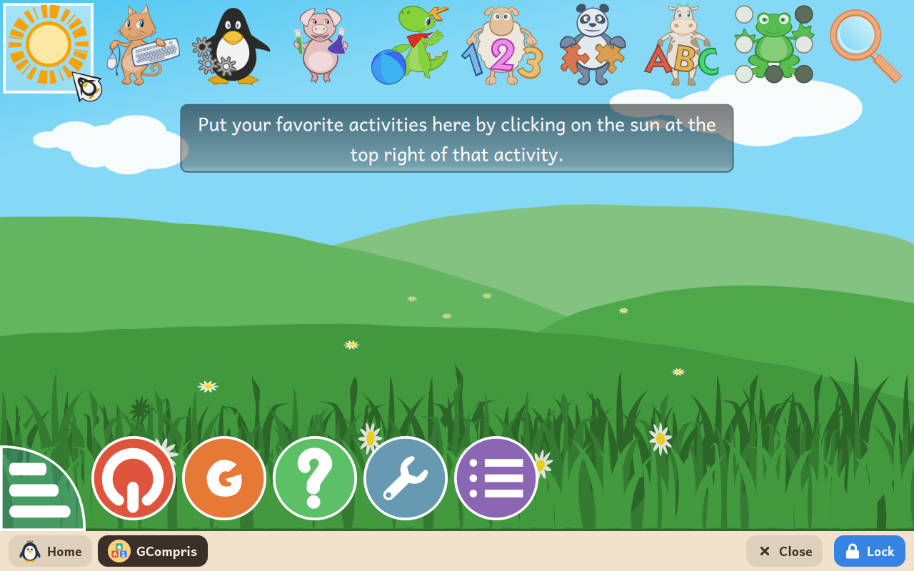

### Tux Typing

**Tux Typing** teaches a child to type. Letters and words fall from the
sky, and the child catches each one by typing it, one level harder each
time. Its menus are in the child's language, and so are the words that
fall, in Spanish for a Spanish-speaking child. It is for children from six
to twelve, and GCompris, which teaches the keyboard's letters first, is a
good start before it.

Tux Typing keeps its scores and its settings for itself, not in the
child's folders; removing the module keeps them for when it comes back.

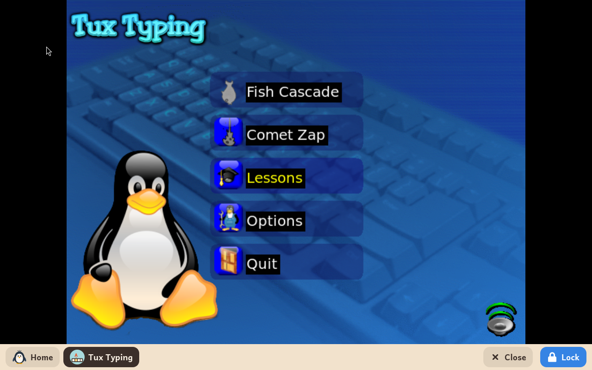

### ScratchJr

**ScratchJr** is Scratch for the youngest, from five to seven: characters
move, talk and play when the child snaps picture blocks together, without a
word to read. It is MIT's own app, as its community has brought it to
computers, and it brings its own copy of a web browser's engine with it:
about 380 MB.

The child's projects are kept in a folder of their own **Documents**,
**ScratchJR**, which ScratchJr makes the first time it is opened.
Removing the module leaves them there.

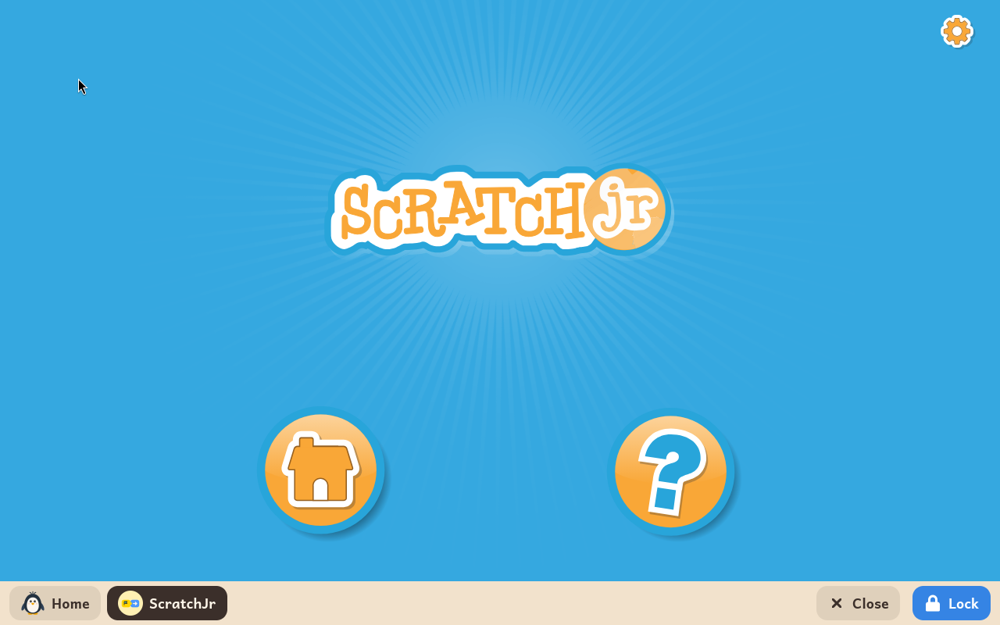

### Blockly Games

**Blockly Games** are puzzles that teach, one step harder each time, the
ideas behind programming with blocks: guiding a character through a maze,
flying a bird, drawing with a turtle, making a movie and music. They are
for children from six to twelve who read a little, in the child's
language, and they work without the internet. The games remember how far
the child has got, and removing the module keeps that for when it comes
back.

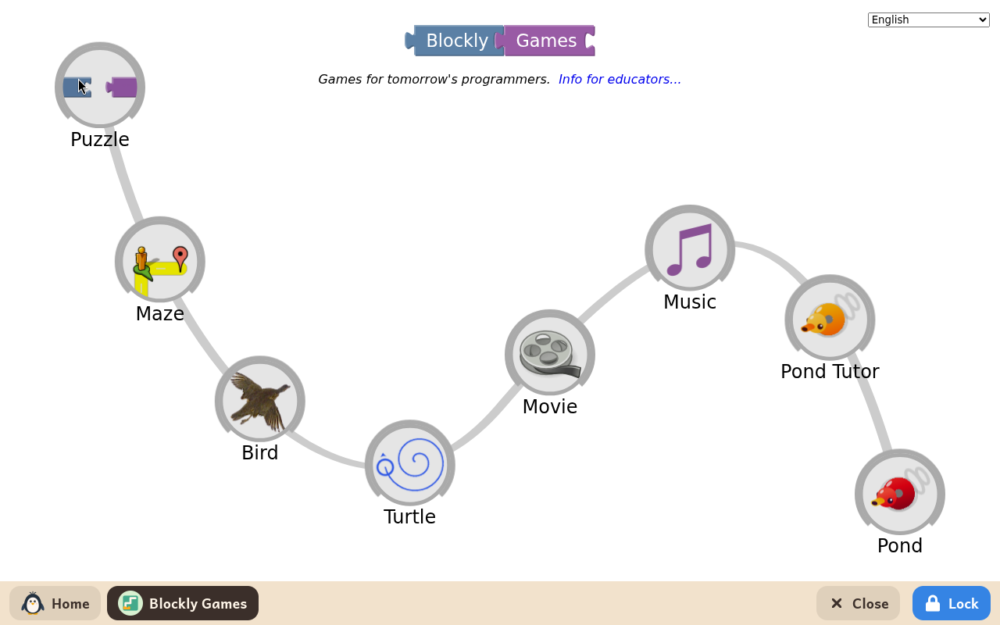

### Scratch

**Scratch** is the editor children use at school to make games, stories
and animations by snapping blocks together. It is Scratch's own editor, in
the child's language, without the Scratch website's community: nothing a
child makes is shared, and nobody else can see it. It is for children from
eight up; ScratchJr, for younger ones, is a good start before it.

Its library of characters, backdrops and sounds comes from the Scratch
Foundation's servers when a child opens it, so it needs the internet then.
Everything else works without it. The tutorials' videos do not play: they
are on a website, and a module shows only its own pages.

To keep a project, the child chooses **File**, then **Save to your
computer**: a window of the child's folders opens, in **Downloads**, to
choose where to keep it and under what name, and **Save** keeps it.
**File**, then **Load from your computer**, opens the same window to pick
it from. A project saved from Scratch opens in TurboWarp too, and the
other way round.

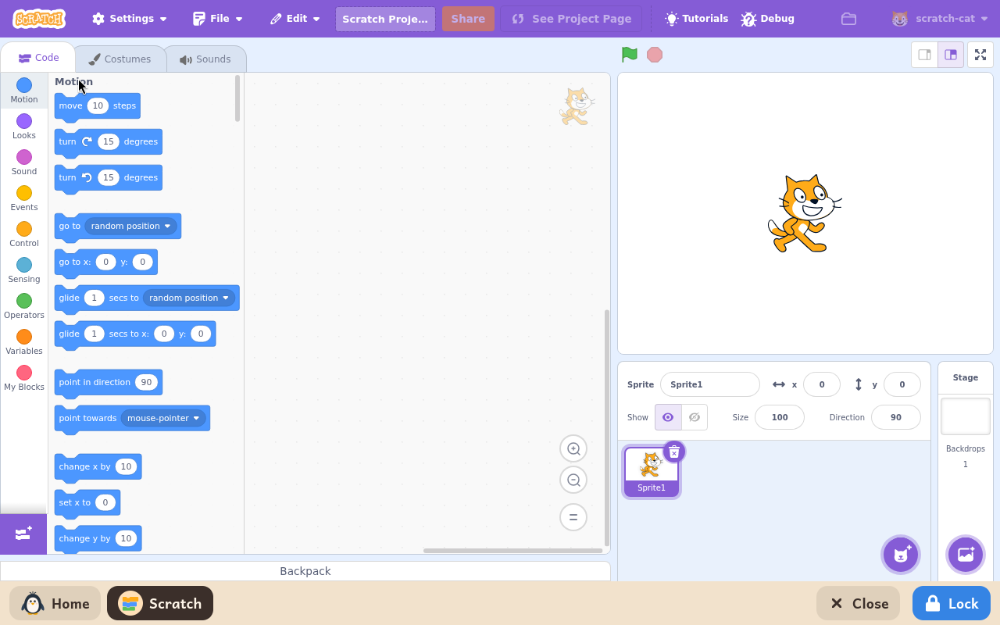

### TurboWarp

**TurboWarp** is Scratch made faster: the same editor, the same blocks and
the same project files, with a compiler that runs projects many times
faster. Choose it instead of Scratch on a slower computer, or when Scratch
does not run well on this one. What is said above of Scratch is true of
TurboWarp too: its library comes from the internet, and a project is kept
in the child's folders, chosen in a window, and opened again from them.
A project is opened from a file only: TurboWarp cannot fetch one from the
Scratch website by its number.

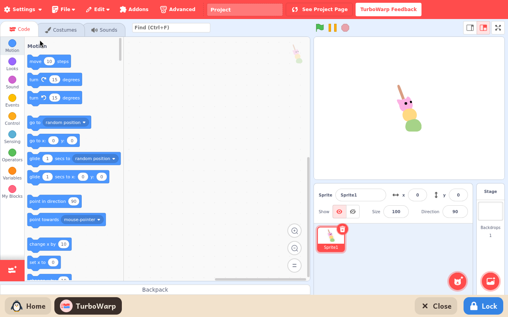

### BASIC

**BASIC** is the language the first home computers spoke, and still a good
way to start writing programs. The module is a small computer of that
time on the left, and a guide to it on the right, for children from eight
to fourteen who read well, in the child's language. It needs nothing from
the internet.

The left half has three parts: the editor at the top, where the child
writes the program, a row of buttons, and the screen below, where the
program shows what it does. **Run** runs the program, and so does
Ctrl+Enter. A program that never ends is stopped with **Stop**, or with
Escape. When a line has a mistake, the words under the screen say which
line, and the editor marks it.

The right half is the guide, one chapter at a time, with **Back**,
**Next** and the list of **Chapters**. The child reads a program there
and types it in the editor; the button under each program types it in for
them, unless an adult has switched *Type it in for me* off for the child
in BASIC's **Settings** on the panel, so that the child types every
program. Its thirty chapters go from a first `PRINT` to drawing, colour,
sound and games to keep. Each chapter ends with ideas to keep trying, and
a box **For the adult** that says what the chapter teaches.

The program in the editor stays there when BASIC is closed, until the
child presses **New**. To keep a program, **Save** opens a window of the
child's folders, in **Downloads**, to choose where to keep it and under
what name, as a `.bas` file; **Open** opens the same window to bring one
back.

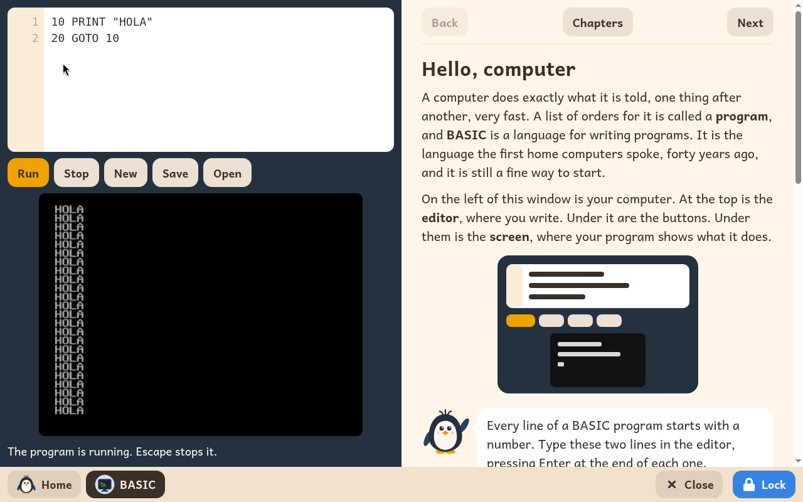

### CodeCombat

**CodeCombat** is a door to the CodeCombat website, where children from
nine learn to write real Python and JavaScript by playing: a hero walks
through each level as the child's program tells it. The site is
CodeCombat's, in the child's language, and the module opens it and no
other website. Kidux has no connection with CodeCombat.

It needs the internet, and a CodeCombat account. The first levels are
free; most of the site needs a subscription, which an adult buys on
another computer, since the module opens no other site.

An adult gives each child's account in CodeCombat's **Settings** on the
panel: its email address and its password. Then the module signs the
child in by itself each time it is opened, saying *Connecting to
CodeCombat…* meanwhile, sets the site's language to the child's, and
opens where the playing starts. The child never sees the password. When
the account is wrong or the site does not answer, the module says so and
offers to try again. Without an account given, the module opens the
site's front page, and the child signs in there with the account's email
address and password: signing in through Google, Facebook or Clever leads
nowhere here. The site may ask about its cookies the first time; that is
the site's own question.

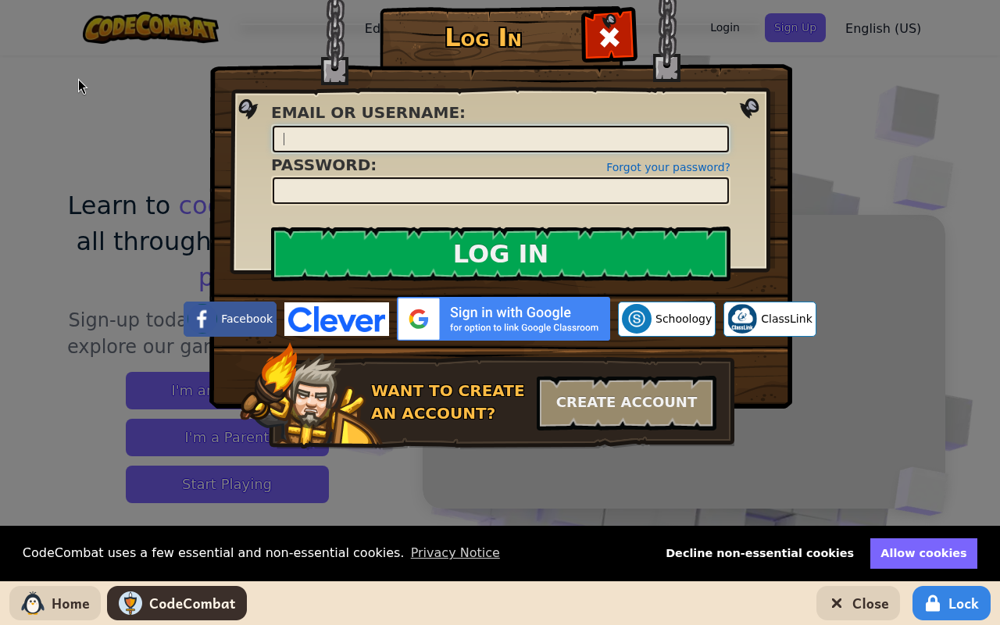

### Wikipedia

**Wikipedia** is a door to the whole encyclopedia, in the child's
language, and to the projects it links to, such as Wiktionary and
Wikibooks. It is Wikipedia as everyone reads it, written for everyone and
not only for children, so an adult decides whether a child reads it, from
eight up. A link out of Wikipedia and its projects leads nowhere.

A bar along the top of the window has **Back** and **Forward**, which go
to the page before and the page after, and are dimmed where there is
nowhere to go; **Alt+Left** and a mouse's own back button go back too. It
needs the internet whenever it is used.

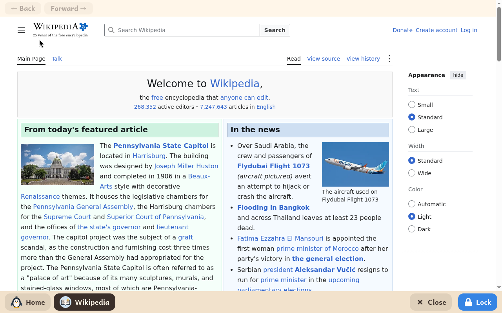

## 10. Updates and reinstalling

Security updates install themselves in the background, from Debian and
from Kidux. Nothing needs doing, and a child's session is never
interrupted by one.

Everything else is installed from the adult panel's **System** page:

1. Press **Look for updates**. The page says how many updates there are,
   and which.
2. Press **Install**. A bar shows how far the installation has got.
3. If an update needs the computer restarted, the page says so, with
   **Restart now**.

Updates are only installed while no child is signed in, so that nothing a
child is using changes under them. The page says so if a child is signed
in.

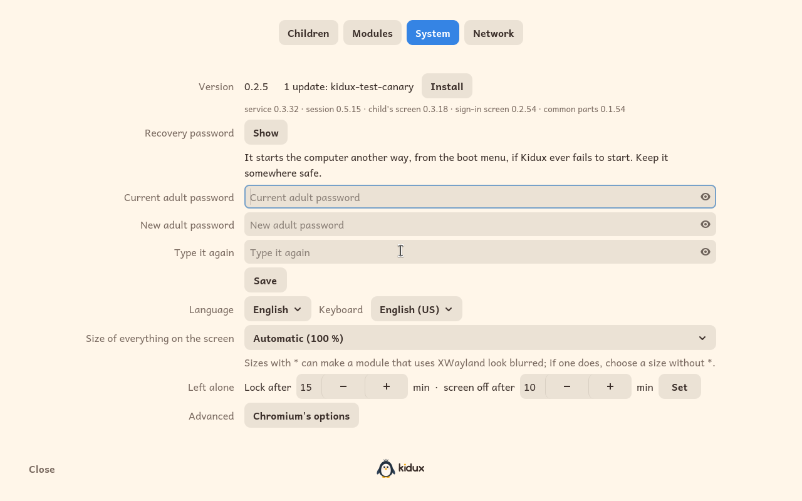

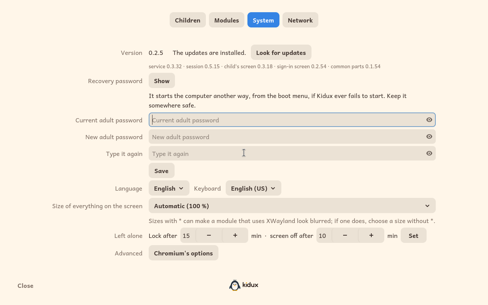

## 11. If something goes wrong

### Kidux does not start

The computer keeps Debian's own way of starting behind the recovery
password, the one shown on the adult panel's **System** page.

1. Turn the computer on, and press Escape once or twice during the first
   second, before the logo appears. A menu appears.
2. The menu asks for a user name and a password. The user name is `kidux`.
   The password is the recovery password.
3. Choose the first Debian entry.

The computer starts as a plain Debian, without Kidux's screens. Someone who
knows Debian can then look at what went wrong.

### An administrator needs a text login

Kidux switches the text logins off, because a login prompt on a child's
computer is a door. To get one back for a repair:

1. Reach the menu as above.
2. Press `e` on the **Kidux** entry.
3. Add `kidux.console` at the end of the line that starts with `linux`.
4. Press F10.

The text logins come back for that start only.

### Taking Kidux off a computer

Remove the package `kidux-session` and restart. The computer is an
ordinary Debian machine again. The children's accounts, their files and
every setting stay, so Kidux can be put back later exactly as it was.

## 12. Getting help

Open an issue on the project's GitHub page, in English or in Spanish.
