# Manual de uso de Kidux

*[English version](../en/user-guide.md)*

Este manual es para el adulto que se ocupa de un ordenador con Kidux. Los
niños no necesitan manual: cada pantalla a la que pueden llegar se explica
sola.

## 1. Qué hace falta

- Un ordenador con **procesador de 64 bits**. Lo tiene casi cualquier PC o
  portátil fabricado a partir de 2008.
- Al menos **2 GB de memoria**. Con 4 GB va mejor.
- **32 GB de disco**, y el disco entero. Kidux guarda el sistema en una
  parte del disco y el trabajo de los niños en otra. Así el sistema se
  puede actualizar, o incluso reinstalar, sin tocar nada de lo que los
  niños han hecho.

## 2. Instalar Kidux

## 3. El primer arranque

Cada vez que arranca, el ordenador muestra el logo de Kidux hasta que la
primera pantalla está lista.

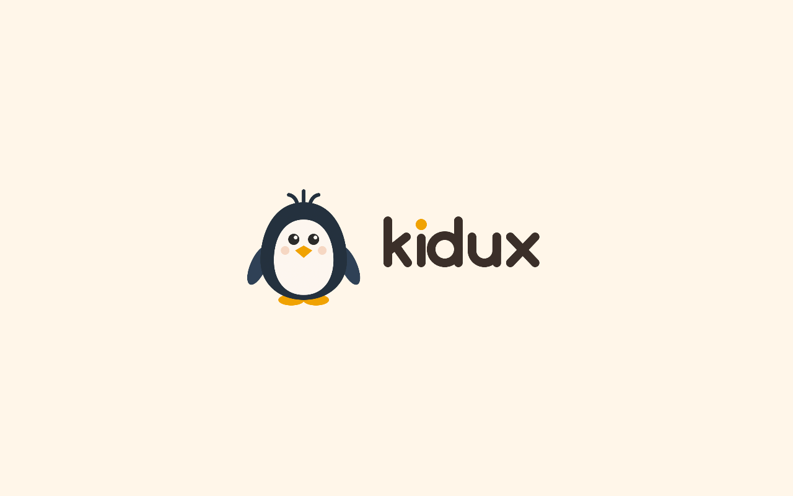

La primera vez que arranca, el ordenador se configura contigo. Lleva unos
minutos. No hace falta ningún atajo de teclado ni ninguna terminal: son
cinco pantallas, una detrás de otra.

1. **Idioma.** Elige el idioma del ordenador. Cada idioma aparece escrito
   en sus propias palabras, para que encuentres el tuyo esté la pantalla
   en el idioma que esté.

   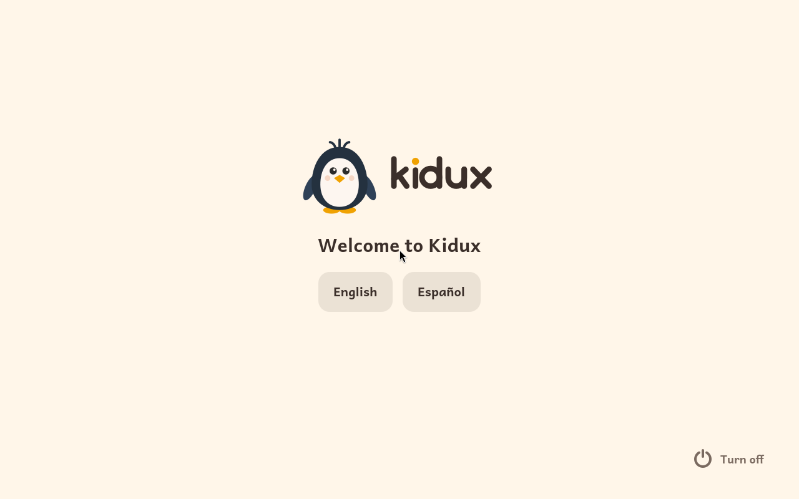

2. **Teclado.** Elige el teclado que tiene tu ordenador. La pantalla se
   reinicia sola para usarlo. A partir de ahora, todas las contraseñas se
   escriben con este teclado, en todas las pantallas que piden una.

   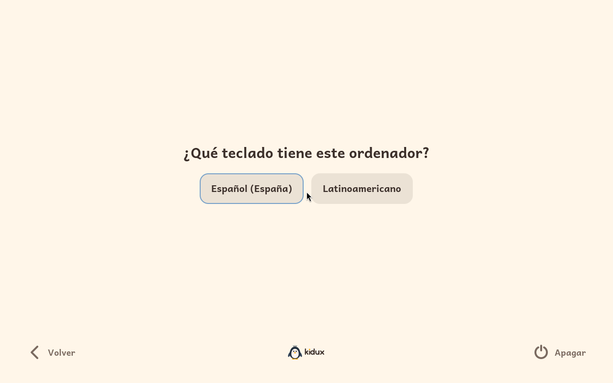

3. **La contraseña de adulto.** Escríbela dos veces. Esta contraseña abre
   el panel de adulto, donde decides todo lo que tiene que ver con los
   niños. Elige una que los niños no puedan adivinar, y no dejes que te
   vean escribirla. No hay ninguna regla sobre su longitud ni sobre sus
   caracteres. Una más larga es, simplemente, más difícil de adivinar.

   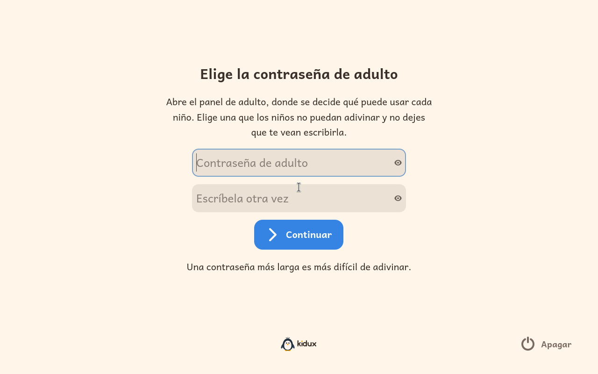

4. **El primer niño.** Todo lo del niño está en una sola pantalla:

   - su nombre;
   - un dibujo con el que se reconozca;
   - su idioma;
   - su propia contraseña, escrita dos veces. Para un niño pequeño puede
     ser muy sencilla;
   - cómo puede usar el ordenador (sección 6). Empieza en una hora al
     día.

   Con el nombre y la contraseña basta. Pulsa **Añadir**.

   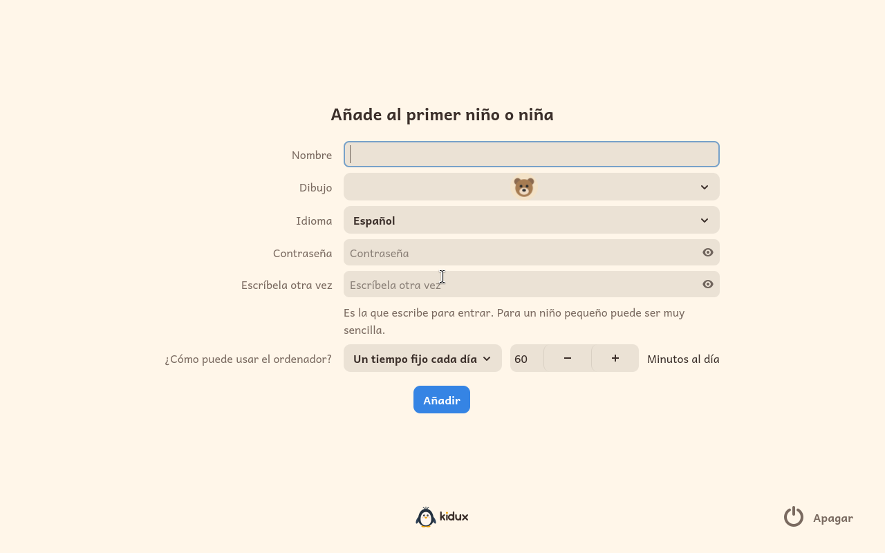

5. **Listo.** Aparece la pantalla de inicio, con el dibujo del niño. Todo
   se puede cambiar más adelante desde el panel de adulto, y allí se
   pueden añadir más niños.

   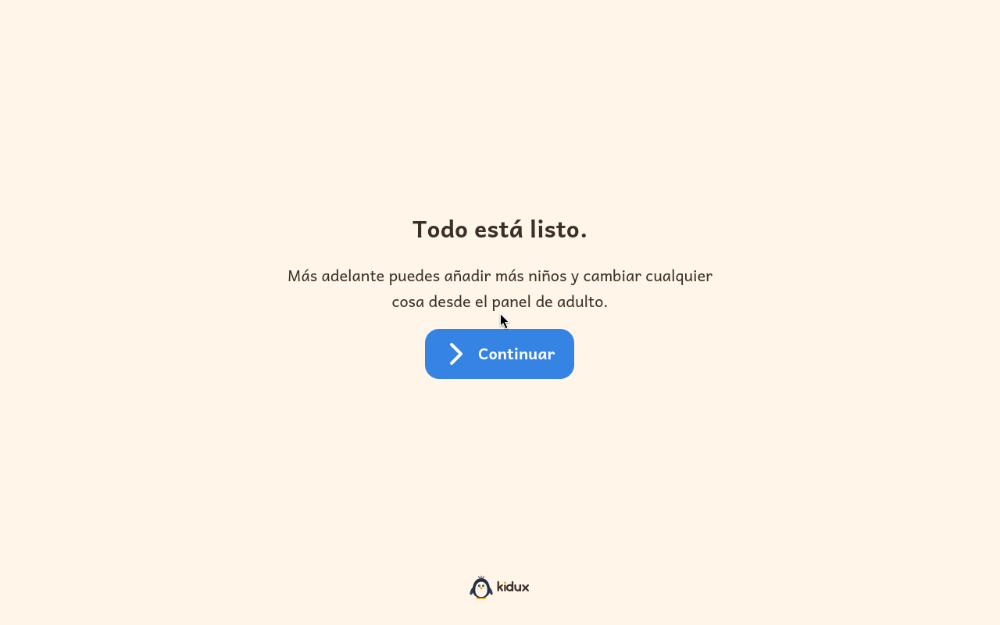

## 4. La pantalla de inicio

El ordenador siempre arranca aquí. También vuelve aquí cuando un niño
sale.

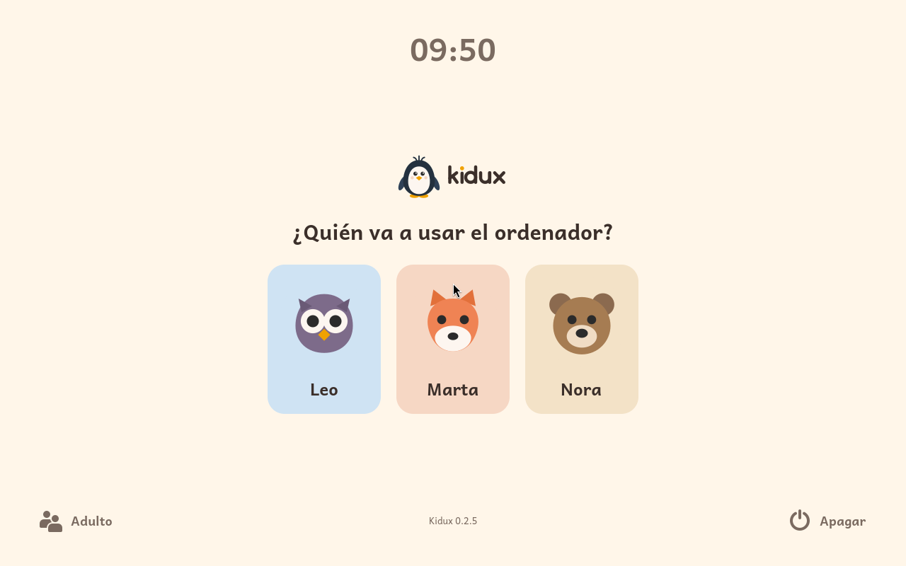

Cada niño tiene su dibujo y su nombre. Para entrar, el niño toca su dibujo
y escribe su contraseña. En cuanto toca el dibujo, la pantalla cambia al
idioma de ese niño. Dos niños con idiomas distintos ven cada uno el suyo.

Abajo, en letra pequeña, la pantalla dice qué Kidux es este: por ejemplo,
**Kidux 0.2.3**. Después de una actualización, el número cambia. La
pantalla de bloqueo también lo dice, bajo el logo.

En un portátil, la esquina de arriba a la derecha muestra la batería, el
sonido, la luz del teclado y el brillo de la pantalla, igual que la
pantalla de un niño (sección 5). La esquina está en esta pantalla, en la de
bloqueo y en las del adulto por igual. Las teclas del propio portátil para
esas cosas funcionan también en todas ellas.


Una contraseña equivocada nunca es una regañina. La pantalla dice que la
contraseña no es correcta, y deja al niño intentarlo otra vez.

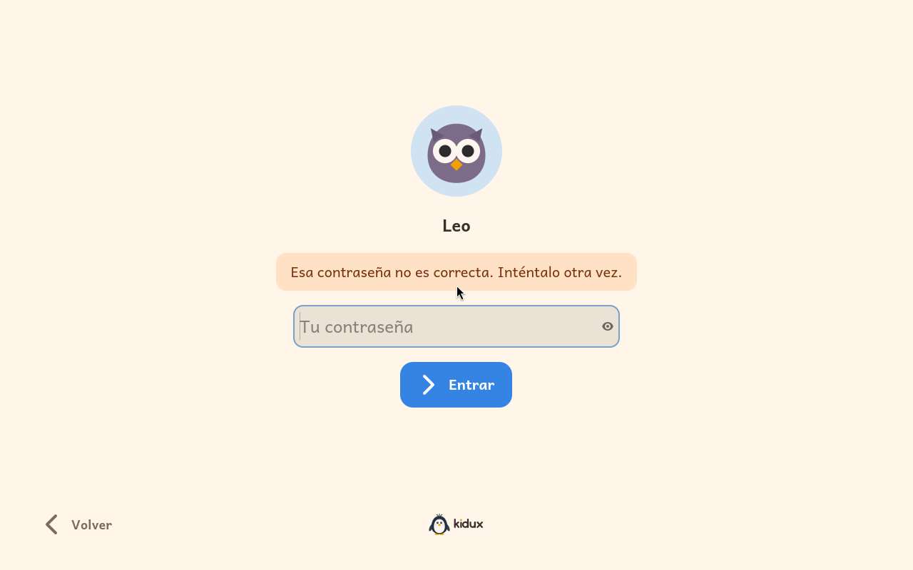

Si el niño ya ha usado todo su tiempo del día, la pantalla se lo dice y le
ofrece **Pedir más tiempo a un adulto**. Se toca y se escribe la contraseña
de adulto. La pantalla dice entonces cuánto tiempo le queda al niño, y
ofrece quince, treinta o sesenta minutos, o el número que se quiera. Se
elige uno, y el niño entra.

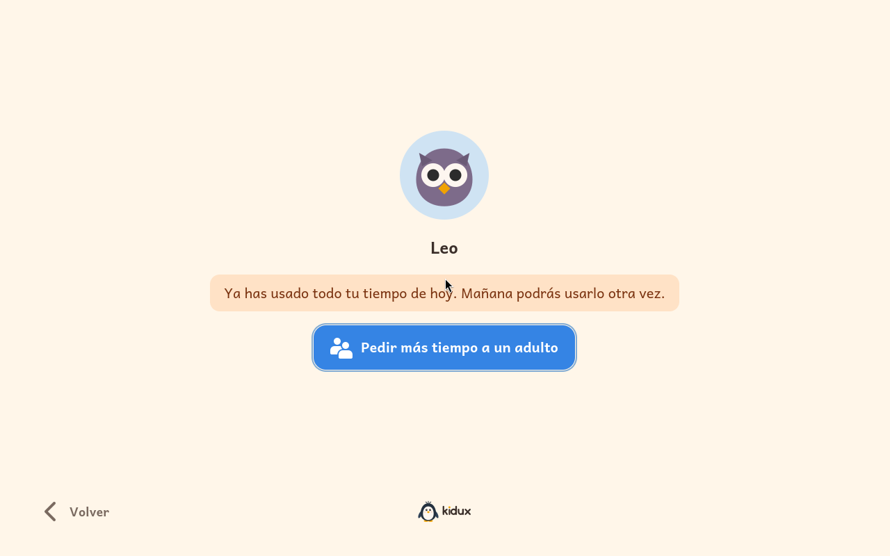

Un día de la semana que no es del niño (sección 6), la pantalla le dice que
hoy el ordenador no es para él, y le ofrece el mismo **Pedir más tiempo a
un adulto**.

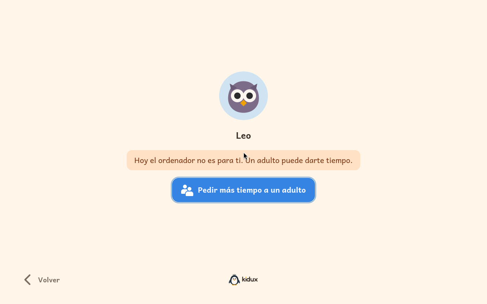

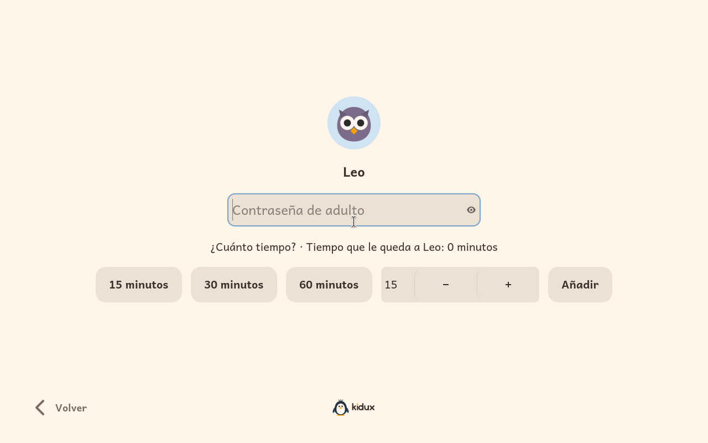

En las esquinas de la pantalla hay dos botones más:

- **Adulto**, abajo a la izquierda, pide la contraseña de adulto y abre el
  panel de adulto.
- **Apagar**, abajo a la derecha, pregunta una vez y después apaga o
  reinicia el ordenador. Un niño siempre puede hacerlo.

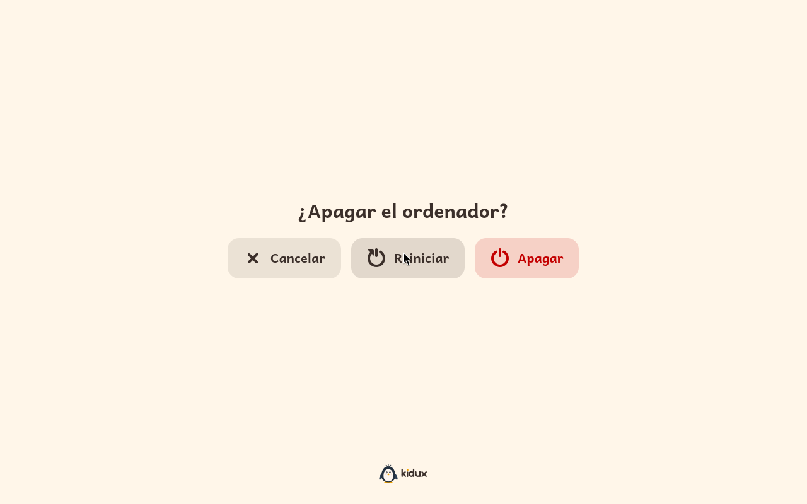

## 5. La sesión de un niño

### La pantalla del niño

Una vez dentro, el niño ve su propia pantalla y nada más. En ella hay:

- su dibujo y su nombre;
- el reloj;
- cuánto tiempo le queda hoy, si su tiempo está limitado: un reloj de
  arena y las horas y los minutos, por ejemplo **00:51**. Al dejar el
  puntero encima, o al tocarlo, lo dice con palabras: *Te quedan 51
  minutos*;
- los módulos de aprendizaje que un adulto le ha activado, una ficha cada
  uno.

En un portátil, la esquina de arriba a la derecha muestra además lo que
tiene la máquina: la batería y su carga, y el sonido, la luz del teclado y
el brillo de la pantalla. Cada una de esas tres cosas es un botón que abre
un control deslizante. El del sonido tiene **Silenciar** debajo. Un
ordenador que no tenga alguna de estas cosas, sencillamente, no la
muestra.

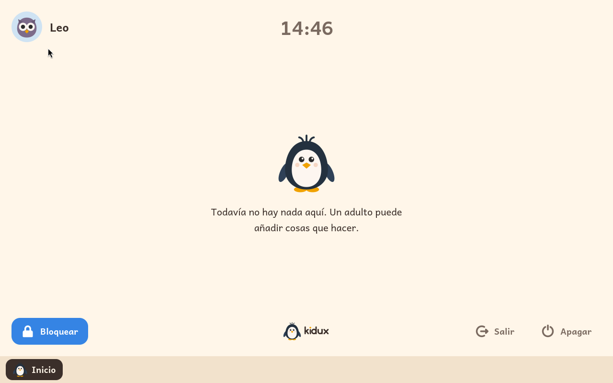

### Abrir un módulo

Cada módulo activado para el niño es una ficha, con su dibujo y su nombre
en el idioma del niño. El niño abre uno tocándolo. También funciona con el
teclado: Tab hasta las fichas, las flechas hasta la que quiere, e Intro.

Cuando hay más fichas de las que caben en la pantalla, aparece una barra a
la derecha, y una sombra en la parte de abajo muestra que hay más fichas
debajo.

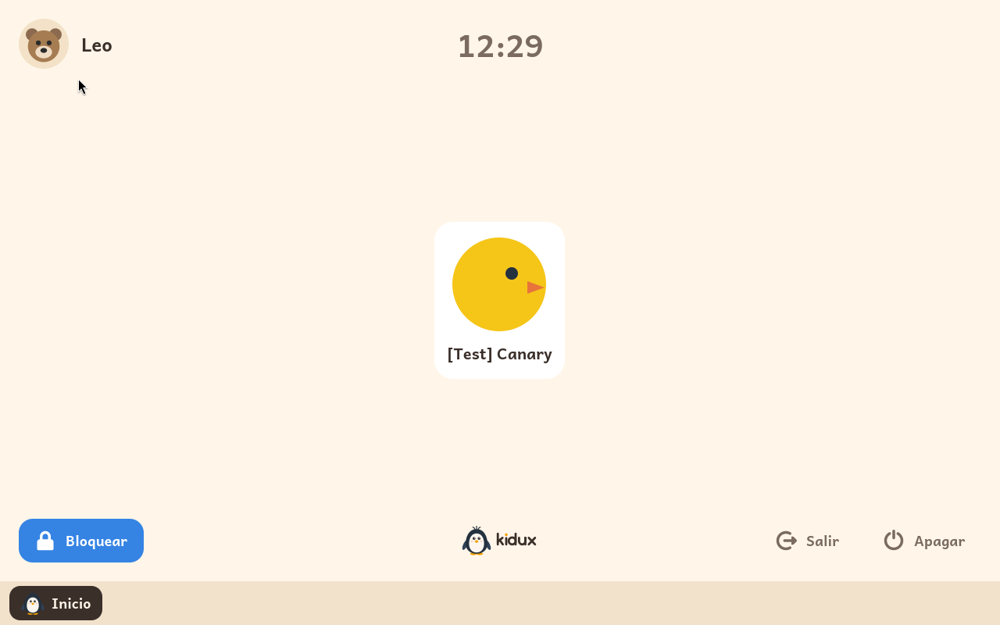

Un módulo se abre ocupando la pantalla por encima de una barra que se queda
siempre en la parte de abajo. Puede haber varios módulos abiertos a la
vez, y el niño pasa de uno a otro como en cualquier ordenador. Tocar la
ficha de un módulo que ya está abierto lleva a él, en vez de abrirlo otra
vez.

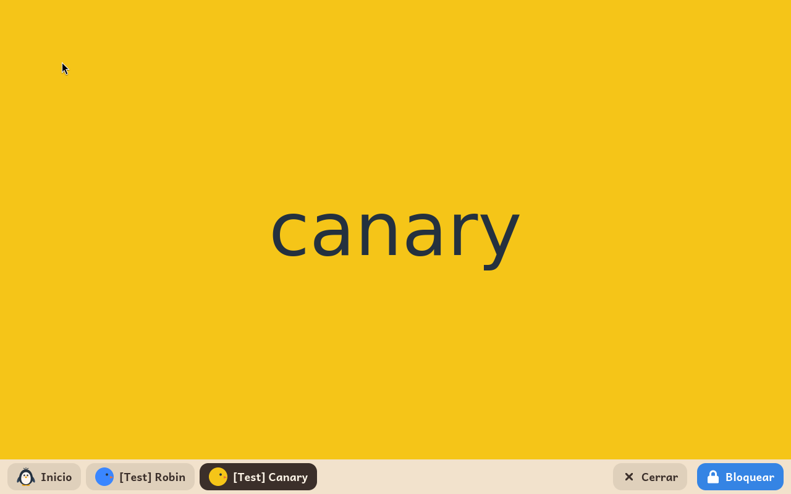

### La barra

La barra de abajo tiene siempre:

- **Inicio**, que vuelve a la pantalla del niño;
- un botón por cada módulo abierto, con el que está en pantalla marcado.
  Los botones ocupan todo el sitio que hay entre **Inicio** y el tiempo
  que queda.

Mientras hay un módulo en pantalla, la barra muestra también el tiempo que
queda (el reloj de arena), **Cerrar** y **Bloquear**.

**Cerrar** cierra el módulo que está en pantalla. Primero se le pide al
módulo, como a cualquier programa cuando se cierra su ventana, para que un
módulo con trabajo sin guardar pueda avisar. Si el módulo sigue abierto
diez segundos después, la barra pregunta si cerrarlo igualmente:

- **Cancelar** lo deja abierto;
- **Cerrarlo igualmente** lo cierra. Lo que no se haya guardado se pierde.

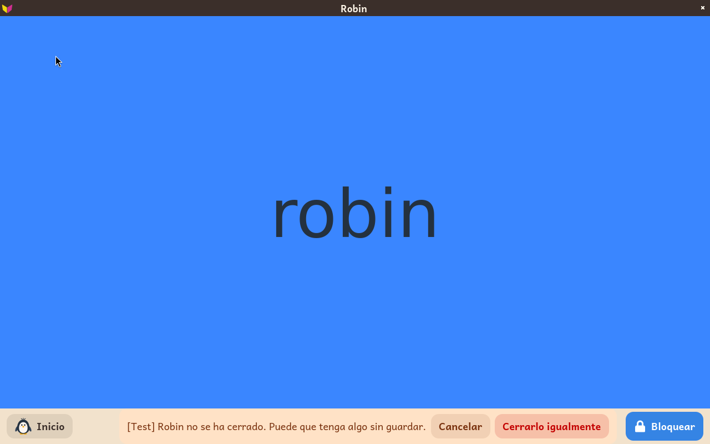

### El teclado

Unas pocas teclas hacen lo mismo que los botones de la barra:

- La **tecla de Windows** (la del logotipo; **⌘** en un teclado de Mac),
  pulsada sola, vuelve a Inicio.
- **Alt+Tab** recorre los módulos abiertos en el orden en que están en
  la barra: pasa al siguiente a la derecha del módulo que está en
  pantalla, y del último vuelve al primero. Desde la pantalla del niño,
  pasa al primero. Manteniendo **Alt**, cada pulsación de **Tab** ilumina
  el siguiente en la barra, y al soltar **Alt** se pasa al iluminado.
  **Alt+Mayúsculas+Tab** recorre al revés. Alt+Tab nunca lleva a la
  pantalla del niño: para eso está la tecla de Windows. Con un solo
  módulo abierto, y en pantalla, no hace nada.
- **Alt+F4** es **Cerrar**. Pulsada otra vez mientras la barra pregunta,
  cierra el módulo igualmente.

Al dejar el puntero sobre un botón de la barra, dice la tecla que hace lo
mismo, para que el niño pueda aprenderlas. En un Mac, donde F4 necesita la
tecla fn, **Cerrar** dice **Alt+(fn)F4**. El módulo al que iría Alt+Tab
dice **Alt+Tab**.

### Las teclas propias de un portátil y su tapa

Las teclas propias de un portátil para el brillo de la pantalla, la luz
del teclado y el sonido (más alto, más bajo y silencio) hacen lo que
dicen, dentro de cualquier módulo. La esquina de la pantalla del niño
muestra el nuevo nivel al momento.

Cerrar la tapa bloquea la sesión del niño y apaga la pantalla. Al abrirla
la pantalla se enciende en la pantalla de bloqueo, donde el niño escribe
su contraseña para seguir. El tiempo no cuenta mientras la tapa está
cerrada.

Las mismas teclas funcionan en la pantalla de inicio y en la de bloqueo,
y cerrar la tapa allí también apaga la pantalla.

### Los archivos, bloquear y salir

Un archivo que el niño hace en un módulo queda guardado en sus propias
carpetas, donde cualquier otro módulo puede abrirlo.

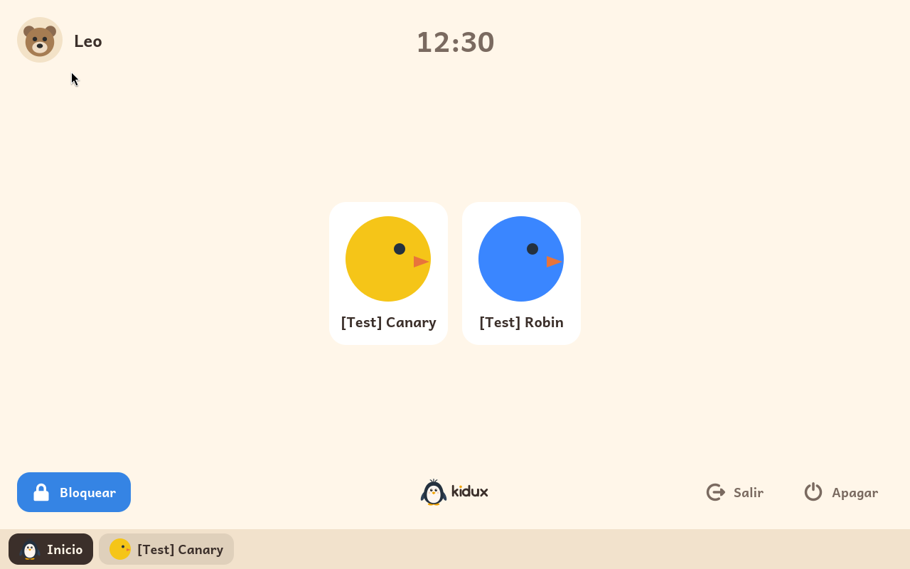

Abajo, en la pantalla del niño, hay tres botones:

- **Bloquear**, abajo a la izquierda, bloquea la pantalla al momento. Así es
  como un niño se levanta sin gastar tiempo: el tiempo no cuenta mientras
  la pantalla está bloqueada, y todo se queda exactamente como estaba.
- **Salir** cierra la sesión y vuelve a la pantalla de inicio. Antes
  pregunta si el trabajo del niño está guardado, porque salir cierra todos
  los módulos.
- **Apagar** hace aparecer la pantalla de bloqueo, desde la que se puede
  apagar el ordenador.

Una sesión que se deja sola también se bloquea sola: tras cinco minutos
sin que nadie toque el teclado ni el ratón, como haría un salvapantallas, y
un módulo que se mueve solo no es una excepción. A los diez minutos la
pantalla se apaga, en todas las pantallas del ordenador, también la de
inicio y la de bloqueo, y el primer toque la vuelve a encender. Un adulto
puede cambiar los dos tiempos en la página **Sistema** del panel de adulto
(sección 8).

Bloquear la pantalla deja cada módulo exactamente donde estaba. Salir,
desde la pantalla del niño o desde la pantalla de bloqueo, cierra todos
los módulos con la sesión, así que conviene guardar antes.

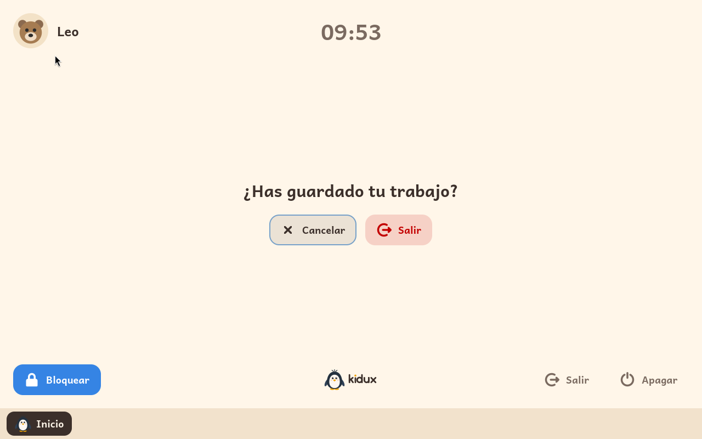

### Cuando el tiempo está a punto de acabarse

Diez, cinco y un minuto antes de que se le acabe el tiempo, un mensaje en
la pantalla le dice al niño que guarde su trabajo. Cuando el tiempo se
acaba, la pantalla de bloqueo aparece sola.

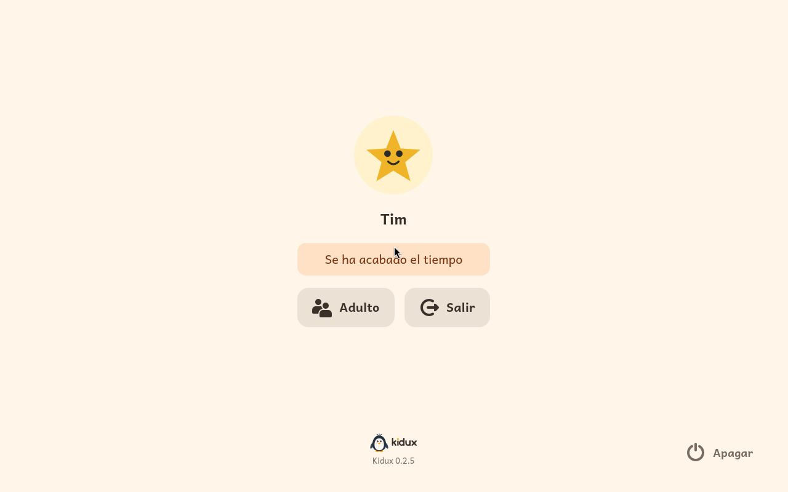

## 6. El tiempo

Cada niño usa el ordenador de una de tres maneras. Un adulto elige cuál:

- **Siempre que quiera.** No hay límite. El ordenador cuenta igualmente
  cuánto tiempo pasa el niño, para que un adulto pueda verlo.
- **Un tiempo fijo cada día.** Tantos minutos al día. El tiempo cuenta
  mientras la sesión está desbloqueada, haga algo el niño o no, y se
  detiene mientras la pantalla está bloqueada. El día empieza de nuevo a
  las cuatro de la madrugada, no a medianoche, para que una sesión de tarde
  no quede partida en dos. El tiempo extra que dé un adulto un día así dura
  hasta que acaba ese día.
- **Solo cuando un adulto lo permita.** El niño no puede entrar hasta que
  un adulto le dé tiempo, en la pantalla de inicio. El tiempo dado así se
  guarda hasta que se usa, aunque pasen días.

Las dos primeras maneras valen los **días** de la semana que marque un
adulto. Para un niño nuevo están marcados todos. Los demás días el
ordenador no es del niño: no puede entrar si un adulto no le da tiempo, y
ese tiempo dura hasta que acaba el día. Un niño que siga usando el
ordenador cuando empieza uno de esos días, a las cuatro de la madrugada,
encuentra la pantalla bloqueada, igual que cuando se le acaba el tiempo.

Dos cosas que conviene saber:

- El tiempo cuenta mientras la sesión está desbloqueada. Una sesión que se
  deja abierta durante la cena gasta el tiempo del día. Conviene que el
  niño bloquee la pantalla siempre que se levante.
- El tiempo ya gastado se recuerda aunque el ordenador se reinicie, se
  vaya la luz o el sistema falle.

## 7. La pantalla de bloqueo

La pantalla de bloqueo aparece sobre la sesión de un niño cuando se le
acaba el tiempo, cuando el niño bloquea la pantalla, cuando la sesión se
queda unos minutos sin que nadie la toque, cuando se cierra la tapa de un
portátil, y siempre que alguien pulsa el botón de encendido del
ordenador. Lo que el niño
estaba haciendo se queda exactamente como estaba, debajo, y nada suyo
sigue funcionando.

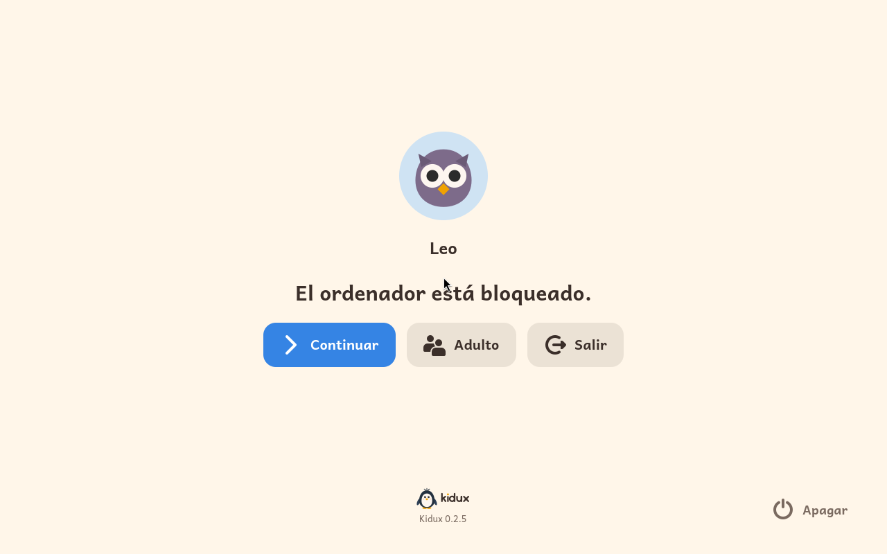

La pantalla de bloqueo ofrece cuatro cosas:

- **Continuar.** El niño escribe su contraseña y sigue, mientras le quede
  tiempo.
- **Adulto.** La contraseña de adulto, y después una de cuatro opciones:
  - **dar más tiempo**, viendo cuánto le queda al niño;
  - **desbloquear para guardar el trabajo**, que desbloquea la pantalla
    unos minutos sin contarlos, para que el niño guarde y vuelva a
    bloquear;
  - **salir**, que cierra la sesión;
  - el **panel de adulto** (sección 8).
- **Salir.** El niño escribe su contraseña y la sesión se cierra.
- **Apagar.** Pregunta una vez y después apaga el ordenador.

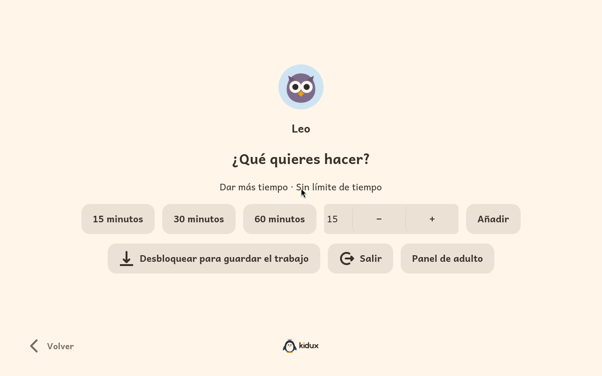

El botón de encendido nunca apaga el ordenador por sí solo. Siempre hace
aparecer esta pantalla. Así, una contraseña solo se escribe en una
pantalla que es de verdad de Kidux, y nunca en algo que un programa del
niño haya dibujado para parecerse a ella.

## 8. El panel de adulto

### Abrirlo y cerrarlo

Pulsa **Adulto** en la pantalla de inicio, o **Adulto** y después **Panel
de adulto** en la pantalla de bloqueo, y escribe la contraseña de adulto.
El panel ocupa toda la pantalla. Se cierra con **Cerrar**, con la tecla
Escape, o solo, tras cinco minutos sin tocarlo, o los minutos que diga la
página **Sistema** para un ordenador que se deja solo. Nadie puede dejarlo
abierto sin querer.

Una costumbre mantiene la contraseña de adulto a salvo: **pulsa el botón de
encendido del ordenador antes de escribirla**, siempre que un niño haya
estado usando el ordenador. El botón de encendido siempre hace aparecer la
pantalla de bloqueo, que es de Kidux. Así, la pantalla en la que escribes
nunca es algo que haya dibujado un programa de un niño.

El panel tiene cuatro páginas: **Niños**, **Módulos**, **Sistema** y
**Red**. Cada página cabe en una sola pantalla, y todo se cambia en el
sitio, sin ir de una pantalla a otra.

Cuando una página tiene más de lo que cabe en la pantalla, con muchos niños
o muchos módulos, o en una pantalla pequeña, aparece una barra a su
derecha, o en la parte de abajo, y una sombra en el borde por donde sigue
la página. Arrastra la barra, o desplázate, para ver el resto. Todas las
pantallas de Kidux hacen lo mismo.

### Niños

Arriba, todos los niños, con el elegido marcado, y **Añadir un niño**.

Debajo, el tiempo del niño elegido:

- cuánto tiempo ha usado hoy;
- botones para **darle más tiempo** en ese momento;
- **Le queda hoy**: los minutos que le quedan. Puedes cambiarlos a
  cualquier número, cero incluido, y pulsar **Fijar**. Ponerlos a cero
  termina su tiempo ya, aunque esté usando el ordenador: la pantalla de
  bloqueo sale al momento.

Y debajo, todo lo del niño:

- su nombre;
- su dibujo;
- su idioma;
- una contraseña nueva, si quieres cambiarla;
- cómo puede usar el ordenador (sección 6), y los **días** de la semana en
  que vale eso, de lunes a domingo;
- **Ventanas**, que se explica más abajo.

Cambia lo que quieras y pulsa **Guardar**. Si algo no se puede guardar,
queda marcado en su sitio, y el resto sí se guarda. **Añadir un niño**
muestra la misma página, vacía.

**Eliminar** pregunta una vez, en la misma página. Eliminar a un niño borra
su cuenta y todo lo que contiene. **Eliminar, pero conservar sus archivos**
borra la cuenta pero deja los archivos del niño en el ordenador. Un niño
que está dentro de su sesión no se puede eliminar hasta que salga.

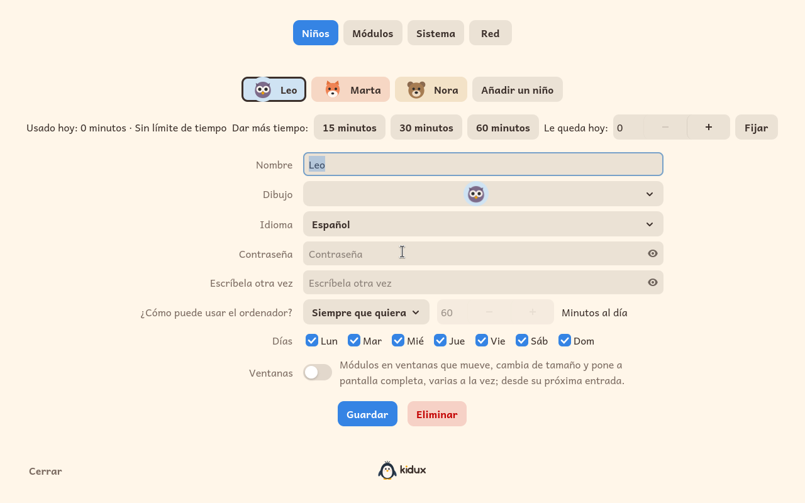

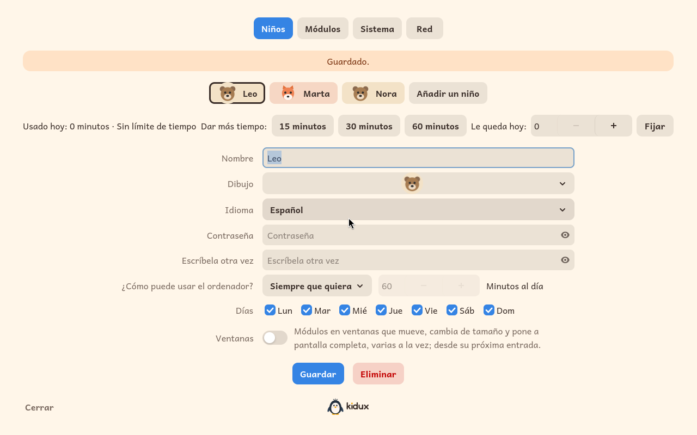

### Ventanas

**Ventanas** está desactivado para un niño nuevo. Entonces cada módulo de
aprendizaje ocupa la pantalla por encima de la barra, que es lo más
sencillo para un niño pequeño.

Con **Ventanas** activado, los módulos del niño se abren en ventanas,
varias a la vez, como en cualquier ordenador:

- cada ventana tiene una barra de título para moverla, bordes para
  cambiarle el tamaño, y botones para minimizarla, maximizarla y
  cerrarla;
- lo que se copia en una ventana se puede pegar en otra;
- la barra tiene un botón por ventana, con la que está en uso marcada y
  las minimizadas más claras. Tocar un botón trae su ventana delante.
  Cuando hay más botones de los que caben, una flecha a cada lado muestra
  los demás;
- **Inicio**, y la tecla de Windows, muestran el escritorio: todas las
  ventanas minimizadas y las fichas del niño a la vista. Tocar una ficha,
  o el botón de una ventana en la barra, trae las ventanas de vuelta como
  estaban, con la pedida delante. Una ventana que el niño minimizó sigue
  minimizada.

El cambio se aplica la próxima vez que el niño entra.

Algunos módulos de aprendizaje, un navegador web de verdad por ejemplo,
solo funcionan con ventanas. Lo dicen en la página **Módulos**, donde no se
pueden activar para un niño sin ventanas.

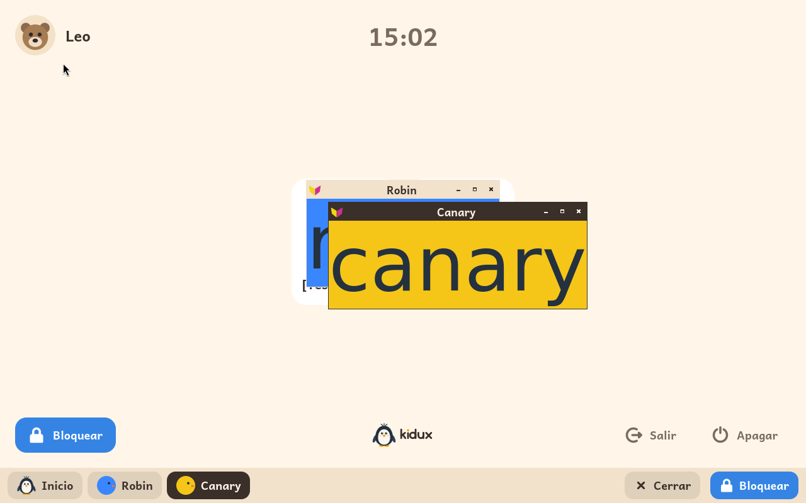

### Módulos

La página **Módulos** muestra cada módulo de aprendizaje instalado en el
ordenador, con su nombre y para qué sirve. Junto al nombre, en letra más
pequeña, están las edades para las que está pensado el módulo y su
versión. Debajo, cuando los hay, **Módulos previos recomendados:** nombra
los módulos que conviene hacer antes. Es un consejo: cualquier módulo se
puede activar para cualquier niño.

Las dos listas van de los módulos para los niños más pequeños a los de los
mayores, y los módulos cuyo nombre empieza por **[Prueba]** van al final.
La casilla de arriba, **Buscar un módulo**, deja en las listas solo los
módulos cuyo nombre o descripción tiene lo que escribes en ella.

Cada módulo tiene un interruptor para cada niño, bajo el dibujo del niño.
Un interruptor se guarda en cuanto lo cambias, y la pantalla del niño lo
sigue al momento, aunque esté usando el ordenador.

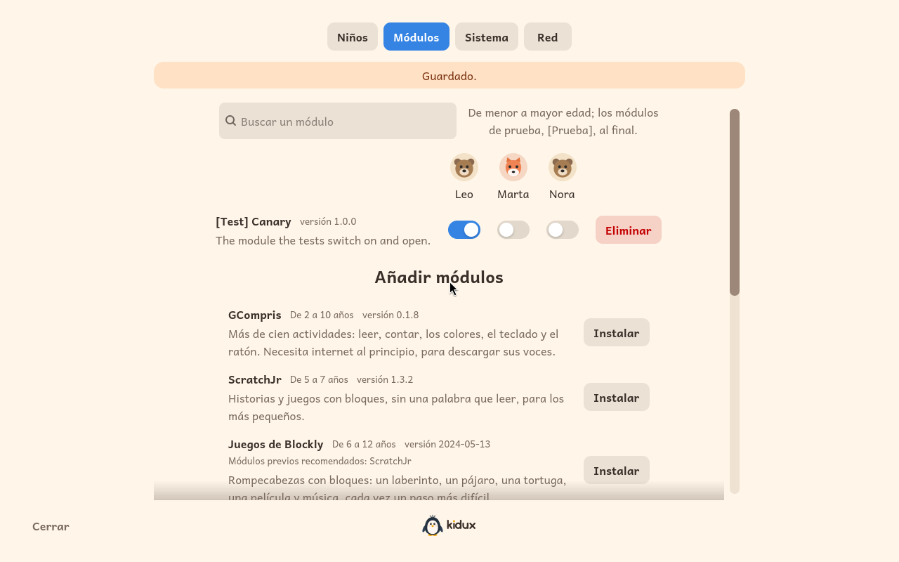

Debajo de los módulos instalados, **Añadir módulos** muestra los módulos de
aprendizaje que ofrece Kidux y que aún no están en el ordenador, con las
mismas edades y módulos que hacer antes.

- **Instalar** añade uno. La página enseña cuánto le falta. Después, el
  módulo aparece arriba, apagado para todos los niños.
- **Eliminar**, al final de la fila de un módulo instalado, pregunta una
  vez y quita el módulo del ordenador. Lo que cada niño hizo con él se
  queda en sus propias carpetas.
- **Buscar módulos** pregunta a Kidux qué ofrece ahora. Necesita conexión a
  internet.

Los módulos solo se instalan y se quitan cuando no hay ningún niño dentro
de su sesión, para que nada de lo que esté usando cambie mientras tanto.

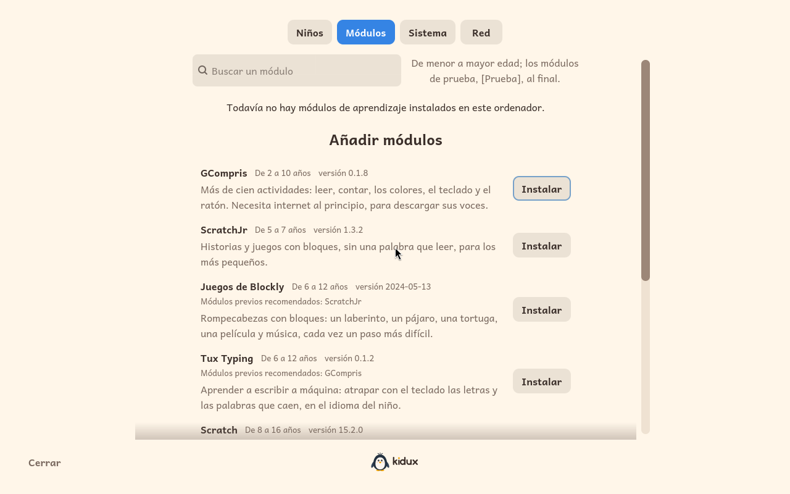

### Sistema

La página **Sistema** contiene, de arriba abajo:

- **La versión de Kidux**, y debajo, más pequeña, la versión de cada una
  de sus partes. Esto es lo que hay que dar a quien te ayude a averiguar
  qué ha fallado. Junto a la versión, las actualizaciones (sección 10).
- **La contraseña de recuperación.** Sirve para arrancar el ordenador de
  otra forma desde el menú de arranque, si alguna vez Kidux no arranca
  (sección 11). Apúntala en un lugar seguro.
- **Cambiar la contraseña de adulto**, escribiendo la actual y la nueva dos
  veces.
- **El idioma y el teclado del ordenador.**
- **El tamaño de todo lo que hay en la pantalla.** Es **Automático** hasta
  que eliges, con el tamaño que eso da entre paréntesis: por ejemplo,
  **Automático (175 %\*)**. Automático quiere decir tan grande como
  permite la pantalla dejando sitio de sobra. Elige un tamaño menor para
  tener más sitio en una pantalla grande, o uno mayor para ver todo más
  grande.

  Los tamaños marcados con \* no son múltiplos enteros de 100 %. Un
  módulo de aprendizaje hecho para X11, el sistema antiguo de pantalla de
  Linux, puede verse borroso con uno de ellos. Si pasa, elige un tamaño
  sin \*.
- **Si se deja solo**: tras cuántos minutos sin tocarlo se bloquea sola la
  sesión de un niño (cinco, para empezar), que es también el tiempo que
  este panel sigue abierto, y tras cuántos se apaga cualquier pantalla del
  ordenador (diez). Cambia cualquiera de los dos números y pulsa
  **Fijar**. El panel los toma al momento; la sesión de un niño, la
  próxima vez que el niño entra.

El idioma, el teclado y el tamaño se guardan en cuanto los eliges:

- en la pantalla de inicio, se aplican al cerrar el panel: la pantalla
  vuelve a arrancar con ellos, lo que tarda un momento;
- en la pantalla de bloqueo, se aplican la próxima vez que arranca una
  pantalla, porque la pantalla de bloqueo no puede volver a arrancar sobre
  la sesión de un niño;
- la pantalla de un niño los toma la próxima vez que el niño entra.

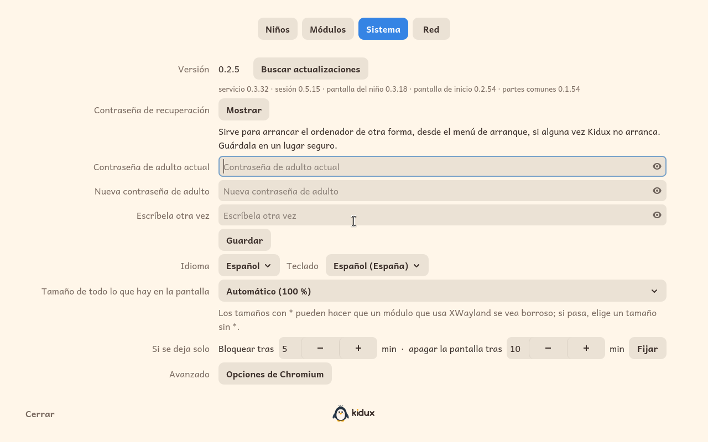

### Avanzado

**Avanzado**, al final de la página Sistema, es para cuando algo no
funciona en este ordenador en concreto.

Las **Opciones de Chromium** son para un módulo de aprendizaje hecho de
páginas web, o para ScratchJr, que lleva Chromium dentro, que se ve mal en
la pantalla de este ordenador, con manchas de ruido o restos de imágenes,
o con una imagen que solo cambia al mover el puntero. Una opción escrita
en el cuadro, una por línea, cambia cómo dibuja Chromium. Se aplica la
próxima vez que se abre el módulo.

Debajo del cuadro, la página enumera las opciones que merece la pena
probar, en el orden en que probarlas, cada una con lo que hace. Sus letras
se pueden seleccionar y copiar en el cuadro. Deja el cuadro vacío salvo que
sepas qué opción necesita tu ordenador: vacío es lo que Kidux hace por su
cuenta.

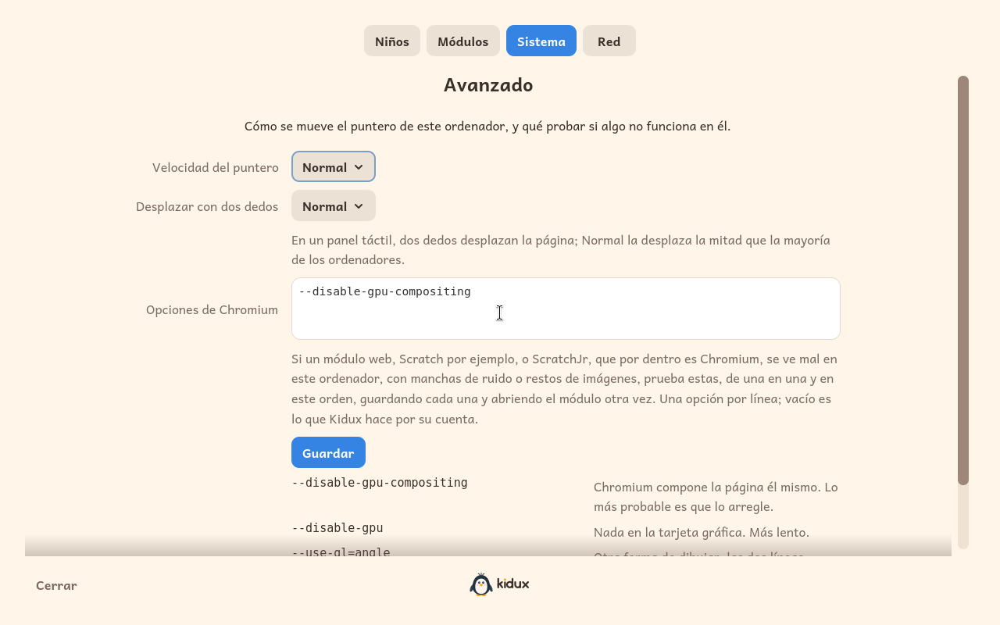

### Red

La página **Red** muestra cómo está conectado este ordenador:

- **Conexión**: cada conexión en una línea, wifi o cable, con el nombre de
  la red, su señal y la dirección del ordenador, o **Sin conexión**.
- **Router**: si el router, el aparato por el que pasa la conexión,
  responde.
- **Mirar otra vez** vuelve a preguntar al router y busca de nuevo redes
  wifi. La página lo hace sola al abrirse.

Cuando la wifi del ordenador se puede cambiar desde aquí, debajo aparecen
las redes wifi al alcance, con la que está en uso primero. Cada una muestra
su señal, y un candado si tiene contraseña.

- **Conectar** se conecta a una red. Cuando la red necesita contraseña, la
  página la pide en la misma línea. El ordenador guarda la contraseña, y
  desde entonces vuelve a conectarse a la red por su cuenta, antes de que
  nadie entre.
- **Olvidar** hace que el ordenador deje de conectarse a una red por su
  cuenta. Pregunta antes.

Cambiar de red puede dejar sin conexión los módulos de los niños un
momento.

La página puede conectarse a la red de una casa o de una cafetería, con
contraseña o sin ella. La red de una oficina o de un colegio que pide un
nombre de usuario propio no se puede configurar aquí.

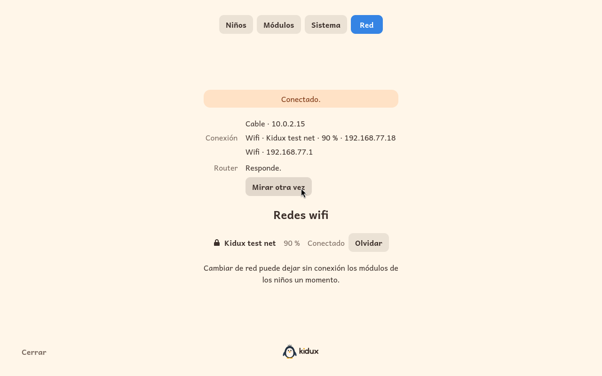

### Una wifi configurada al instalar Debian

Si la página Red dice que la wifi se configuró al instalar Debian, muestra
la conexión pero no puede cambiarla: el instalador de Debian configuró la
wifi a su manera. Para cambiarla desde la página, hay que traspasarla una
vez. Hazlo en el propio ordenador, no desde otro ordenador conectado a él
por esa wifi.

1. Abre una consola de texto. La sección 11 explica cómo.

2. Abre el archivo del instalador:

   ```
   sudo nano /etc/network/interfaces
   ```

3. Busca las líneas que empiezan por `allow-hotplug` o `iface` y nombran
   la tarjeta wifi. Su nombre empieza por `wl`. Borra esas líneas, y las
   líneas de debajo que empiezan por `wpa-`. Guarda el archivo.

4. Reinicia el ordenador:

   ```
   sudo reboot
   ```

Con el reinicio termina la manera del instalador de llevar la wifi. Desde
entonces, la tarjeta wifi la lleva Kidux. Cuando vuelva la pantalla de
inicio, abre el panel de adulto, ve a **Red** y conéctate a la wifi desde
la página, con su contraseña. A partir de ahí, la página la cambia.

## 9. Módulos de aprendizaje

Cada módulo de aprendizaje es algo que un niño puede abrir desde su
pantalla. Un adulto activa cada módulo para cada niño, en la página
**Módulos** del panel de adulto (sección 8).

Algunos módulos están hechos de páginas web. Se abren a toda pantalla por
encima de la barra, en el navegador Chromium, sin barra de direcciones ni
pestañas, y solo muestran sus propias páginas: un enlace que salga de ellas
a cualquier otro sitio no lleva a ninguna parte. Las palabras del propio
Chromium, en la página que muestra en lugar de una bloqueada o en sus
menús, están en el idioma del niño. Chromium es un programa grande, de unos
300 MB, que llega con el primer módulo de este tipo.

Los módulos cuyo nombre empieza por **[Prueba]** existen para comprobar
que Kidux funciona, no para que los use un niño.

### GCompris

**GCompris** son más de cien actividades para niños de dos a diez años:
leer y escribir, contar, los colores y las formas, y aprender a usar el
teclado y el ratón, cada una un pequeño juego. Habla el idioma del niño.

Sus voces y algunos de sus dibujos no están en el ordenador al principio.
GCompris los descarga él solo de internet las primeras veces que se usa,
así que entonces necesita conexión. Funciona sin ellos hasta que han
llegado. El panel lo dice antes de instalar GCompris.

GCompris ocupa toda la pantalla por encima de la barra. El botón **Inicio**
de la barra lleva al niño de vuelta a sus otras cosas.

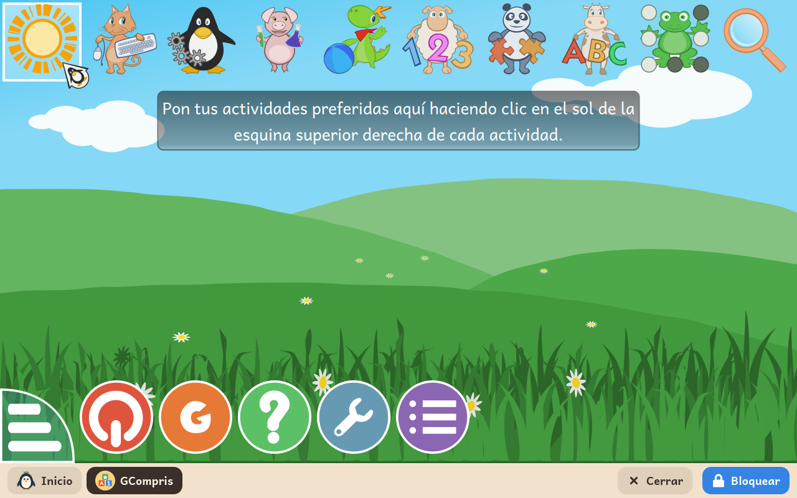

### Tux Typing

**Tux Typing** enseña a un niño a escribir a máquina. Del cielo caen letras
y palabras, y el niño atrapa cada una escribiéndola, cada nivel un poco más
difícil. Sus menús están en el idioma del niño, y también las palabras que
caen, en español para un niño que habla español. Es para niños de seis a
doce años, y GCompris, que enseña primero las letras del teclado, es un
buen comienzo antes.

Tux Typing guarda sus puntuaciones y sus ajustes para sí, no en las
carpetas del niño, y al quitar el módulo se quitan también.

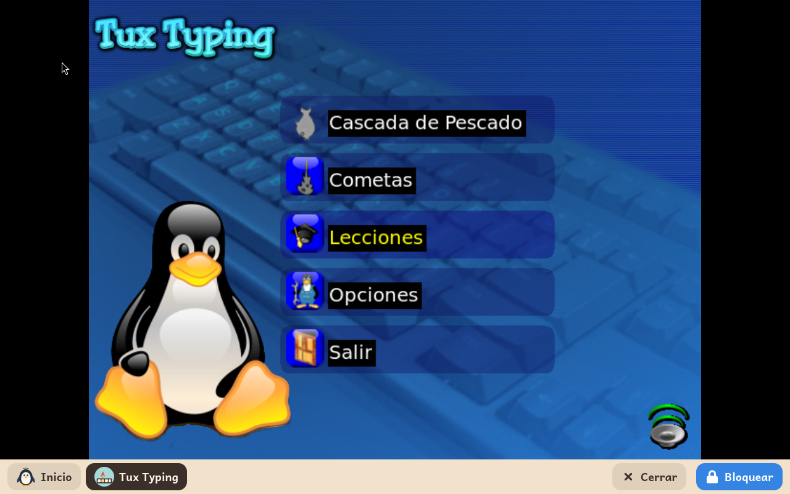

### ScratchJr

**ScratchJr** es Scratch para los más pequeños, de cinco a siete años: los
personajes se mueven, hablan y juegan cuando el niño encaja bloques con
dibujos, sin una palabra que leer. Es la propia aplicación del MIT, tal
como su comunidad la ha llevado a los ordenadores, y trae consigo su
propia copia del motor de un navegador web: unos 380 MB.

Los proyectos del niño se guardan en una carpeta de sus **Documentos**,
**ScratchJR**, que ScratchJr crea la primera vez que se abre. Quitar el
módulo los deja ahí.

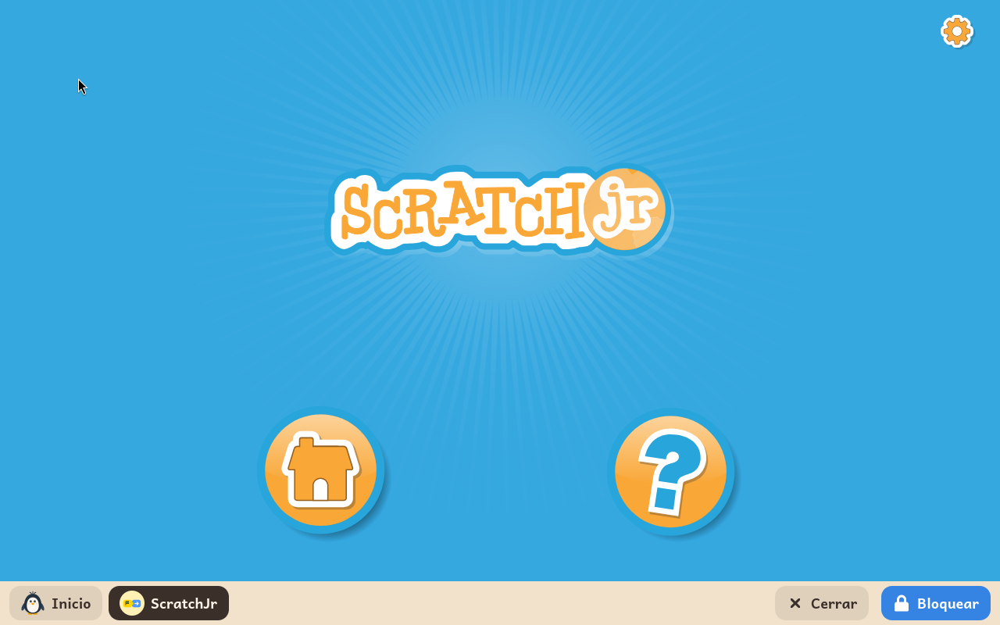

### Juegos de Blockly

Los **Juegos de Blockly** son rompecabezas que enseñan, cada uno un paso
más difícil, las ideas de programar con bloques: guiar a un personaje por
un laberinto, hacer volar un pájaro, dibujar con una tortuga, hacer una
película y música. Son para niños de seis a doce años que ya leen un poco,
en el idioma del niño, y funcionan sin internet. Los juegos recuerdan
hasta dónde ha llegado el niño, y quitar el módulo lo olvida.

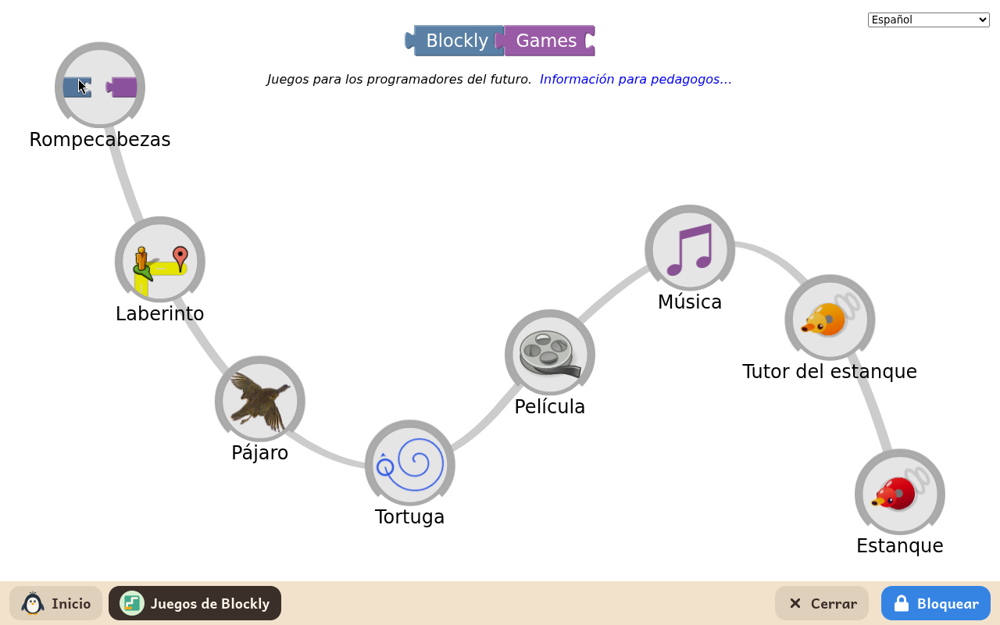

### Scratch

**Scratch** es el editor que los niños usan en el colegio para hacer
juegos, historias y animaciones encajando bloques. Es el propio editor de
Scratch, en el idioma del niño, sin la comunidad de la web de Scratch: nada
de lo que hace un niño se comparte, y nadie más puede verlo. Es para niños
a partir de ocho años; ScratchJr, para los más pequeños, es un buen
comienzo antes.

Su biblioteca de personajes, fondos y sonidos viene de los servidores de la
Scratch Foundation cuando el niño la abre, así que entonces necesita
internet. Todo lo demás funciona sin ella. Los vídeos de los tutoriales no
se reproducen: están en una página web, y un módulo solo muestra sus
propias páginas.

Para guardar un proyecto, el niño elige **Archivo** y después **Guardar
en tu ordenador**: se abre una ventana con las carpetas del niño, en
**Descargas**, para elegir dónde guardarlo y con qué nombre, y lo guarda
con **Guardar**. **Archivo** y después **Cargar desde tu ordenador** abre
la misma ventana para escogerlo. Un proyecto guardado desde Scratch se
abre también en TurboWarp, y al revés.

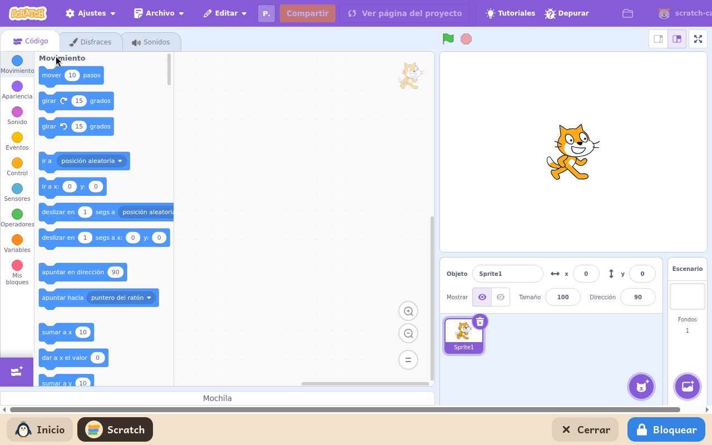

### TurboWarp

**TurboWarp** es Scratch más rápido: el mismo editor, los mismos bloques y
los mismos archivos de proyecto, con un compilador que hace funcionar los
proyectos muchas veces más deprisa. Elígelo en lugar de Scratch en un
ordenador más lento, o cuando Scratch no funcione bien en este. Lo dicho
de Scratch vale también para TurboWarp: su biblioteca viene de internet, y
un proyecto se guarda en las carpetas del niño, elegidas en una ventana, y
se vuelve a abrir desde ellas. Un proyecto se abre solo desde un archivo:
TurboWarp no puede traerlo de la web de Scratch por su número.

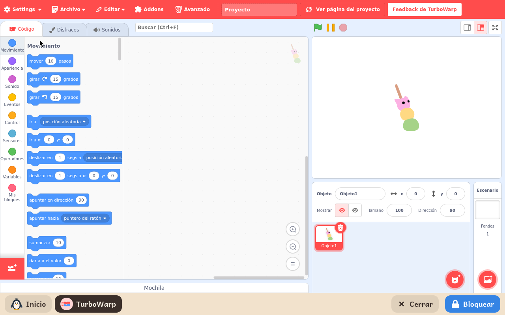

## 10. Actualizar y reinstalar

Las actualizaciones de seguridad se instalan solas, en segundo plano, tanto
las de Debian como las de Kidux. No hay que hacer nada, y nunca interrumpen
la sesión de un niño.

Todo lo demás se instala desde la página **Sistema** del panel de adulto:

1. Pulsa **Buscar actualizaciones**. La página dice cuántas actualizaciones
   hay, y cuáles.
2. Pulsa **Instalar**. Una barra muestra cuánto falta.
3. Si una actualización necesita reiniciar el ordenador, la página lo dice,
   con **Reiniciar ahora**.

Las actualizaciones solo se instalan cuando no hay ningún niño dentro de su
sesión, para que nada de lo que esté usando cambie mientras tanto. Si hay
alguno, la página lo dice.

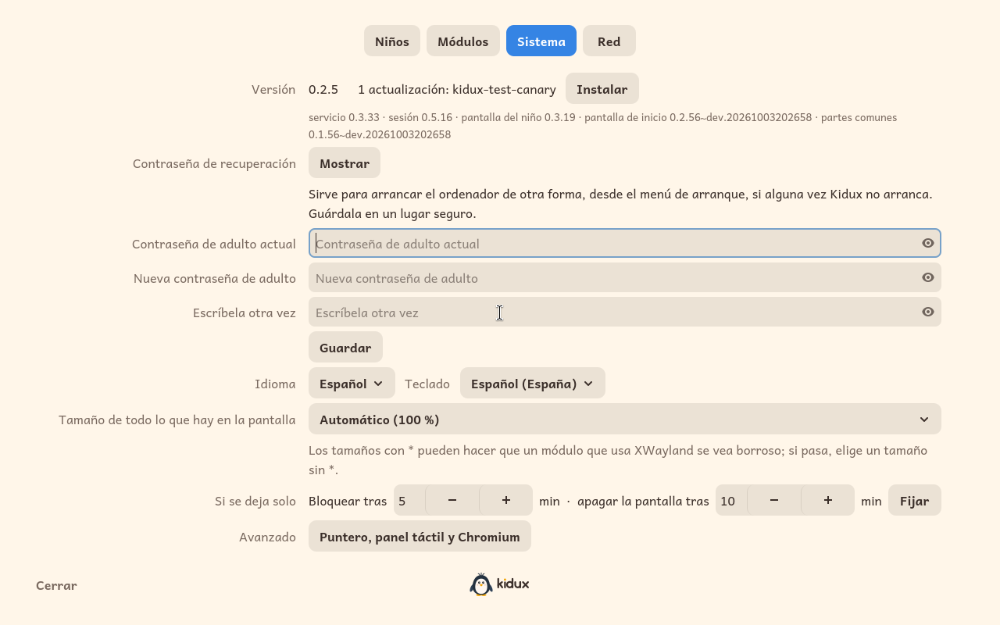

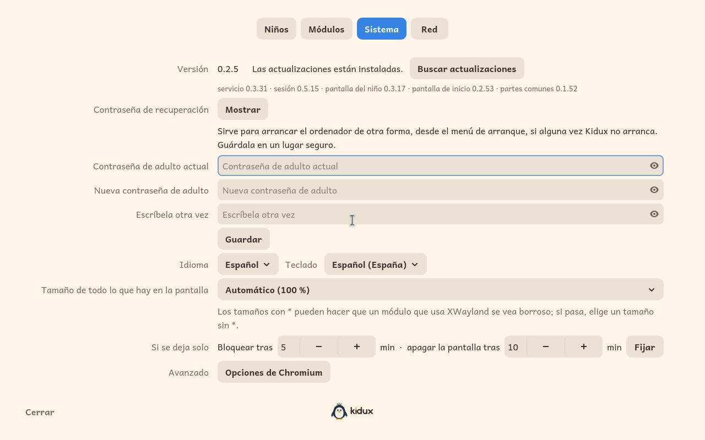

## 11. Si algo va mal

### Kidux no arranca

El ordenador conserva la forma de arrancar de Debian detrás de la
contraseña de recuperación, la que muestra la página **Sistema** del panel
de adulto.

1. Enciende el ordenador y pulsa Escape una o dos veces durante el primer
   segundo, antes de que aparezca el logo. Aparece un menú.
2. El menú pide un nombre de usuario y una contraseña. El usuario es
   `kidux`. La contraseña es la de recuperación.
3. Elige la primera entrada de Debian.

El ordenador arranca como un Debian normal, sin las pantallas de Kidux.
Alguien que conozca Debian puede entonces ver qué ha pasado.

### Un administrador necesita una consola de texto

Kidux desactiva las consolas de texto, porque una pantalla de inicio de
sesión en el ordenador de un niño es una puerta. Para recuperar una y
hacer una reparación:

1. Llega al menú como arriba.
2. Pulsa `e` sobre la entrada **Kidux**.
3. Añade `kidux.console` al final de la línea que empieza por `linux`.
4. Pulsa F10.

Las consolas vuelven solo para ese arranque.

### Quitar Kidux de un ordenador

Desinstala el paquete `kidux-session` y reinicia. El ordenador vuelve a
ser un Debian normal. Las cuentas de los niños, sus archivos y todos los
ajustes se conservan, así que Kidux se puede volver a poner más tarde
exactamente como estaba.

## 12. Dónde pedir ayuda

Abre una incidencia en la página del proyecto en GitHub, en español o en
inglés.
